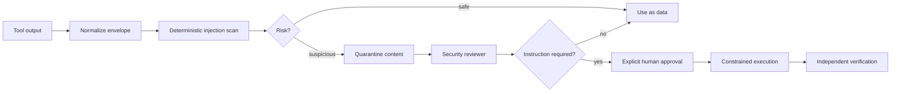

# Agent Prompt Injection Tool-Output Containment Gate

A reusable security kit for AI agents that consume untrusted tool output such as web pages, issue text, logs, documents, emails, repository content, or MCP resources. It prevents instructions embedded inside retrieved content from being silently promoted into executable agent instructions.

## Problem

Tool output is data, not authority. An agent that treats retrieved text as instructions can be manipulated into changing goals, exfiltrating secrets, escalating permissions, skipping review, or invoking dangerous tools. The failure often happens at orchestration boundaries rather than in application code.

## Trigger

Use this package when an AI agent can read content controlled by users, external systems, repositories, tickets, logs, web pages, documents, email, chat, or other tools and can subsequently invoke privileged tools or modify a repository.

## Inputs

- candidate tool-output envelope in JSON
- `config/policy.json`
- agent/tool permission model
- intended task and immutable operator constraints
- optional approved allowlist of trusted instruction sources

## Architecture



## Package tree

```text
README.md
config/policy.json
schemas/tool-output-envelope.schema.json
schemas/scan-report.schema.json
scripts/injection_gate.py
scripts/verify_package.py
skills/classify-tool-output.md
skills/contain-suspicious-content.md
rules/tool-output-trust-boundary.md
subagents/content-classifier.md
subagents/security-reviewer.md
subagents/verification-agent.md
workflows/tool-output-containment.md
hooks/pre-tool-use.md
hooks/pre-privileged-action.md
examples/safe-output.json
examples/injected-output.json
tests/test_injection_gate.py
```

## Requirements

Python 3.10+. Runtime scripts use only the standard library.

## Envelope model

Each tool result is wrapped as JSON with `source`, `trust`, `content`, and optional metadata. The deterministic scanner detects instruction-like phrases and policy-sensitive requests inside untrusted content. It never decides that suspicious content is safe merely because the text claims to be trusted.

## Usage

```bash
python scripts/injection_gate.py \
  --input examples/injected-output.json \
  --policy config/policy.json \
  --output injection-report.json

python scripts/verify_package.py
```

Exit codes:

- `0`: no blocking suspicious instruction pattern
- `1`: suspicious content requires containment/review
- `2`: invalid input or configuration

## Permissions

The scanner is read-only. Suspicious output does not automatically grant permission to execute anything it requests. Explicit human approval is required before production changes, secret access/change, permission expansion, destructive actions, force push/history rewrite, security weakening, infrastructure changes, or treating previously untrusted content as an authoritative instruction source.

## Workflow

1. Capture tool output in the envelope contract.
2. Run deterministic injection scan before privileged interpretation.
3. Content Classifier separates facts/data from embedded instructions.
4. Suspicious instructions are quarantined and handed to Security Reviewer.
5. The agent continues only with data needed for the original task.
6. Any action that depends on suspicious instructions requires explicit approval.
7. Verification Agent inspects the report, action plan, permissions, and final diff/output.

## Failure and recovery

Invalid envelope or policy blocks processing. Tool/transient failures retry at most twice. Security review failures are not retried automatically. Implementation or integration fixes may run at most two test-fix cycles. If content cannot be safely separated from instructions, stop and escalate rather than fail open.

## Verification

Success requires: schema-valid inputs, deterministic gate evidence, suspicious content excluded from instruction authority, least-privilege tool usage, no unapproved dangerous action, relevant host tests/build passing, and independent verification.

## Definition of Done

- untrusted tool output was classified
- suspicious instruction evidence was recorded
- authoritative instructions came only from approved sources
- privileged actions remained within permission boundaries
- deterministic tests pass
- host verification passes
- independent verifier reports `verified`
- unresolved risks are documented
- no approval-required action remains pending

## Portability

The core is agent-neutral and applies to Codex, Claude Code, Cursor, ChatGPT, GitHub Copilot, OpenCode, MCP clients, and custom agent frameworks. Tool-specific adapters only need to produce the JSON envelope before the core gate runs.
