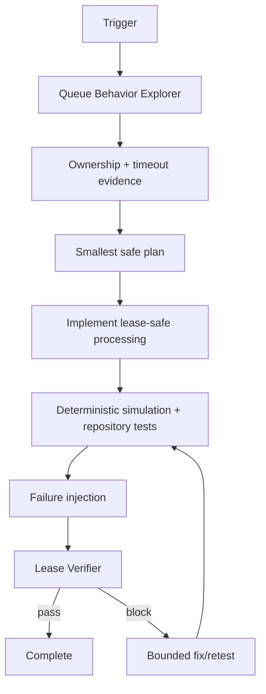

# Agent Queue Visibility Timeout & Lease Renewal Gate

## Problem
Long-running queue handlers can outlive a message visibility timeout or broker lock. If ownership is not renewed correctly, another worker may receive the same message while the first worker is still running. Late settlement with a stale receipt/lock token can then cause duplicate side effects, lost acknowledgements, retry storms, or poisoned dead-letter behavior.

## Purpose
This package gives coding agents and queue-worker maintainers a repeatable workflow for discovering queue ownership semantics, implementing bounded lease renewal, stopping safely on lease loss, protecting side effects with idempotency, and independently verifying the result.

## When to use
Use for Azure Storage Queue, Azure Service Bus, SQS, RabbitMQ-style lease/ack consumers, or any broker where processing ownership expires or must be renewed. It is especially useful when handlers are slow, duplicate delivery appears, visibility/lock settings are changing, or queue retries/dead-letter behavior is under investigation.

## When not to use
Do not use it as a substitute for provider-specific semantics. If the broker has no renewable lease model, adapt the workflow to its acknowledgement contract instead of inventing renewal behavior. Do not use this kit to purge queues or replay dead letters automatically.

## Architecture



## Package tree

```text
agent-queue-visibility-timeout-lease-renewal-gate/
├── README.md
├── config/
│   └── lease-policy.yaml
├── schemas/
│   └── lease-result.schema.json
├── scripts/
│   ├── lease_guard.py
│   └── verify_package.py
├── skills/
│   ├── lease-analysis.md
│   └── lease-safe-processing.md
├── rules/
│   └── queue-lease-safety.md
├── subagents/
│   ├── queue-behavior-explorer.md
│   └── lease-verifier.md
├── workflows/
│   └── lease-protection-workflow.md
├── hooks/
│   └── lifecycle.md
├── templates/
│   └── lease-investigation.md
├── examples/
│   └── lease-result-pass.json
└── tests/
    └── test_lease_guard.py
```

## Component responsibilities
`lease-analysis.md` maps broker ownership and failure paths. `lease-safe-processing.md` defines the implementation procedure. `queue-lease-safety.md` is the enforceable safety boundary. The explorer gathers evidence; the verifier independently proves correctness. `lease_guard.py` provides deterministic ownership/renewal simulation. `verify_package.py` checks package completeness.

## Installation
Copy this directory into the target repository. Python 3.10+ is sufficient for the included deterministic scripts and unit tests; no third-party Python package is required.

## Configuration
Edit `config/lease-policy.yaml` to match the broker and workload. Important values are visibility timeout, renewal safety margin, heartbeat interval, maximum total lease duration, renewal cap, dead-letter delivery count, and transient retry budget.

The core workflow is tool-neutral. Provider-specific receive, renew, abandon, complete/delete, and dead-letter operations must be implemented through the target repository's existing queue SDK or adapter.

## Permissions
Investigation should use repository read access, test execution, logs/metrics, and read-only queue configuration inspection. Production queue changes, purge, destructive dead-letter replay, secret changes, infrastructure changes, or deployment require explicit human approval.

## Usage
From the package root:

```bash
python scripts/verify_package.py
python -m unittest tests/test_lease_guard.py
python scripts/lease_guard.py --message-id smoke-001 --handler-ticks 2 --output lease-result.json
```

For a real repository task, start with `skills/lease-analysis.md`, record findings with `templates/lease-investigation.md`, then apply `skills/lease-safe-processing.md` under `rules/queue-lease-safety.md`. Follow `workflows/lease-protection-workflow.md` through independent verification.

## Workflow
1. Identify receive, ownership token, renewal, handler, settlement, retry, and dead-letter paths.
2. Establish effective timeout and handler-duration evidence.
3. Verify the idempotency mechanism before side-effecting work.
4. Implement bounded renewal using monotonic timing and the latest ownership token.
5. Cancel/stop processing immediately when ownership is lost.
6. Never settle after lease loss.
7. Test normal completion, slow handling, renewal rejection, stale ownership, and duplicate delivery.
8. Independently verify the diff, build/tests, evidence, and approval boundaries.

## Approval boundaries
Explicit approval is required before production visibility/lock changes, queue purge, destructive dead-letter replay, message/data deletion, infrastructure change, secret change, force push/history rewrite, or any change that weakens existing reliability/security controls.

## Failure handling
Transient tooling/provider failures use bounded retries only while enough safe lease time remains. The package policy uses a maximum of three transient retries. Implementation fix/retest loops are limited to two cycles. Permission, provider-contract, or environment failures stop rather than silently increasing privileges. Lease loss immediately blocks successful settlement.

## Verification
Success requires evidence, not code generation alone. At minimum:

- ownership semantics and timeout configuration are identified;
- slow handlers renew before expiry;
- renewal rejection blocks continued processing;
- stale ownership blocks settlement;
- duplicate delivery does not duplicate protected side effects;
- retry and renewal loops are bounded;
- relevant repository tests/build pass;
- package verification passes;
- independent verifier returns `pass`;
- no approval-required operation was executed without approval.

`schemas/lease-result.schema.json` defines the expected structured verification result. `examples/lease-result-pass.json` shows a valid successful shape.

## Recovery
On repeated transient failure, preserve all prior test/log evidence and stop when retry limits are exhausted. On lease loss, do not attempt a late acknowledge; allow the broker's retry/dead-letter policy to recover ownership. On missing idempotency for irreversible side effects, block the change until a safe design exists.

## Definition of Done
The task is complete only when required context is gathered, the smallest safe change exists, all relevant tests/build checks pass, failure-injection tests prove no settlement after ownership loss, idempotency is verified, independent verification passes, required approvals exist, and remaining risks are documented with no blocking failure left unresolved.

## Customization
Keep the skills, rules, workflow, and verification contract stable where possible. Isolate provider-specific SDK calls behind the repository's queue adapter. Adjust lease-policy timing to measured workload latency and broker limits rather than arbitrary values. Add provider-specific integration tests without weakening the core stop-on-lease-loss rule.
