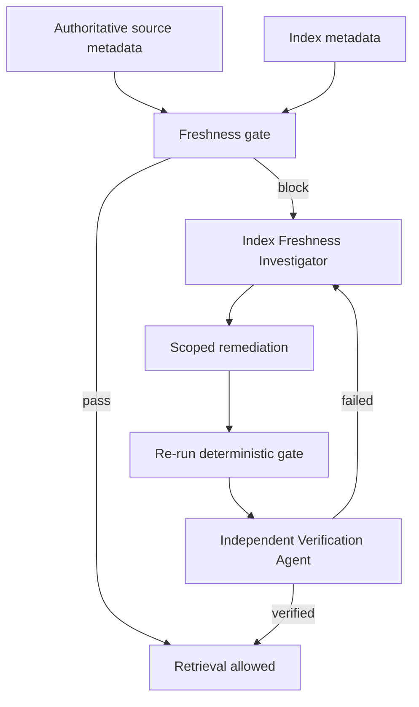

# Agent RAG Index Freshness Staleness Gate

A reusable AI-engineering package that prevents agents and RAG applications from treating stale indexed content as current truth. It compares authoritative source metadata with index metadata, blocks unverified retrieval, guides bounded diagnosis and reindex recovery, and requires independent verification after repair.

## Problem
RAG systems can return syntactically valid, semantically relevant, but outdated content after ingestion delays, dropped events, partial batch failures, stale embeddings, or version/hash mismatches. Successful retrieval is not proof that the index reflects the current source.

## Purpose
Use this package to add a deterministic freshness gate around retrieval-dependent workflows and to structure agent investigation when source and index diverge.

## When to use
Use after document updates, ingestion incidents, index rebuilds, suspicious old answers, before releases depending on retrieval, or whenever source/index consistency matters.

## When not to use
Do not use it as a substitute for semantic answer evaluation, authorization checks, source-quality review, or full observability of the ingestion platform.

## Architecture



## Package tree

```text
agent-rag-index-freshness-staleness-gate/
├── README.md
├── config/
│   └── freshness-policy.yaml
├── schemas/
│   └── freshness-result.schema.json
├── scripts/
│   ├── freshness_gate.py
│   └── verify_package.py
├── skills/
│   ├── investigate-stale-retrieval.md
│   └── reindex-and-verify.md
├── rules/
│   └── rag-freshness-safety.md
├── subagents/
│   ├── index-freshness-investigator.md
│   └── verification-agent.md
├── workflows/
│   └── freshness-gate.md
├── hooks/
│   └── lifecycle.md
├── templates/
│   └── exception-request.md
├── examples/
│   ├── metadata-pass.json
│   └── metadata-block.json
└── tests/
    └── test_freshness_gate.py
```

## Components
- `config/freshness-policy.yaml` defines maximum source age, indexing lag, required evidence, and blocking behavior.
- `scripts/freshness_gate.py` performs deterministic source-versus-index checks and returns exit code 0 for pass, 1 for freshness block, and 2 for execution/configuration errors.
- `schemas/freshness-result.schema.json` defines the handoff/result contract.
- `skills/` provides investigation and recovery procedures.
- `subagents/` separates diagnosis from independent verification.
- `workflows/freshness-gate.md` owns bounded retries, approval boundaries, failure paths, and Definition of Done.
- `hooks/lifecycle.md` describes predictable pre-task, post-reindex, and final verification hooks.
- `tests/` validates both passing and blocking examples.

## Installation
Requires Python 3.10+ and PyYAML.

```bash
python -m pip install pyyaml
python scripts/verify_package.py
python -m unittest tests/test_freshness_gate.py
```

## Input contract
Provide a JSON array. Each record must include:

```json
{
  "id": "doc-1",
  "source_version": "12",
  "indexed_version": "12",
  "source_updated_at": "2026-08-23T11:00:00Z",
  "indexed_at": "2026-08-23T11:04:00Z",
  "content_hash": "sha256:source",
  "indexed_content_hash": "sha256:source"
}
```

`indexed_content_hash` is optional in the current script, but when supplied it must match `content_hash`. Missing core fields are treated as stale/unverified.

## Usage

```bash
python scripts/freshness_gate.py \
  --policy config/freshness-policy.yaml \
  --input examples/metadata-pass.json \
  --output artifacts/freshness-result.json
```

Integrate the same command before retrieval-dependent releases or tasks. A non-zero exit must block success unless a documented temporary exception is approved according to policy.

## Workflow
1. Identify the authoritative source, target index, ingestion path, and sample scope.
2. Collect source/index version, timestamps, and hashes.
3. Run the deterministic freshness gate.
4. If blocked, investigate the earliest divergence stage using `skills/investigate-stale-retrieval.md`.
5. Repair with the smallest safe scoped reindex using `skills/reindex-and-verify.md`.
6. Rerun the gate and representative retrieval queries.
7. Have `subagents/verification-agent.md` independently verify the result.
8. Complete only when the Definition of Done in `workflows/freshness-gate.md` is satisfied.

## Approval boundaries
Explicit human approval is required before deleting/recreating a production index, changing production ingestion configuration, performing a materially high-impact/full production reindex, changing secrets or permissions, or weakening freshness/security controls. Agents stop before those actions.

## Failure handling
Transient metadata, ingestion, and retrieval failures have bounded retries defined in the workflow. Validation, permission, hash mismatch, and policy failures do not trigger blind retries. Evidence from failed attempts is preserved. Privileges are never silently increased.

## Verification
A task is **executed** when the gate or repair command ran. It is **verified successfully** only when the gate reports `pass`, sampled documents have current versions/hashes, acceptance retrievals return current content, independent verification passes after repair, and required approvals/evidence exist.

## Definition of Done
- Authoritative source and index were identified.
- Required metadata was collected.
- Deterministic freshness gate passed.
- Zero sampled records remain stale or unknown.
- Any repair was scoped and evidence-backed.
- Acceptance retrievals returned current versions/content.
- Independent verification passed after remediation.
- Approval references exist for approval-required actions.
- Remaining risks are documented.
- No blocking failure remains.

## Customization
Adjust `config/freshness-policy.yaml` for your source update rate, ingestion SLA, and risk tolerance. Replace the metadata collection step with adapters for your vector database, search service, object store, CMS, SQL database, or repository. Keep the core comparison and approval rules tool-neutral.

## Safe portability
The instructions can be used with Codex, Claude Code, Cursor, ChatGPT, GitHub Copilot, OpenCode, or other coding agents. Tool-specific API calls should be isolated in your own metadata/reindex adapters; the gate contract and workflow remain unchanged.
