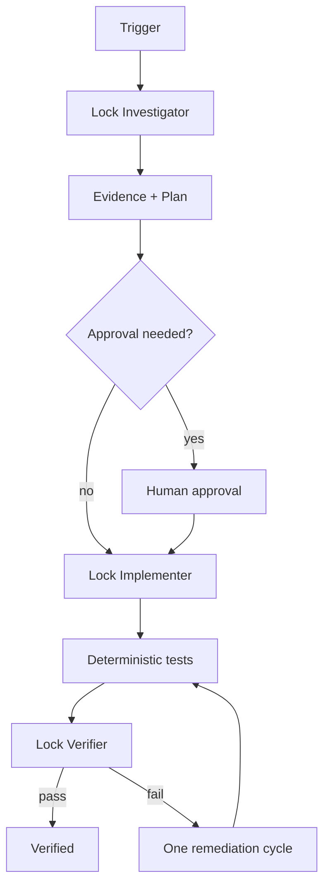

# Agent Redis Distributed Lock Safety Gate

## Problem
Redis-based distributed locks are often implemented with unsafe release, lease assumptions, unbounded retries, or no stale-holder protection. A worker can lose a lease, continue running, and still commit a side effect after another worker has acquired the same lock. Unconditional unlocks can also delete another holder's lock.

## Purpose
This package gives coding agents a reusable, evidence-driven workflow for investigating and fixing Redis distributed-lock correctness. It combines actionable skills, separated investigator/implementer/verifier roles, deterministic lock scripts, tests, bounded retries, fencing tokens, and explicit approval boundaries.

## When to use
Use it for background-job overlap, duplicate processing, scheduled workers, singleton tasks, resource-level mutual exclusion, stale writes after lease expiration, or review of Redis lock code.

## When not to use
Do not use a distributed lock when the operation can instead be made naturally idempotent, serialized by the data store, protected with optimistic concurrency, or routed through a queue partition. This kit also does not authorize production force unlocks or infrastructure changes.

## Architecture



The core safety model is: opaque ownership token + finite lease + atomic owner-checked renew/release + monotonically increasing fencing token + bounded retry/recovery. Fencing is the defense against a process that continues executing after its lease is no longer valid.

## Package tree

```text
agent-redis-distributed-lock-safety-gate/
├── README.md
├── config/lock-policy.yaml
├── rules/distributed-lock-safety.md
├── skills/lock-investigation.md
├── skills/safe-lock-remediation.md
├── subagents/lock-investigator.md
├── subagents/lock-implementer.md
├── subagents/lock-verifier.md
├── workflows/lock-safety-gate.md
├── hooks/lifecycle.md
├── scripts/redis_lock_gate.py
├── scripts/verify_package.py
├── schemas/lock-result.schema.json
├── templates/lock-finding.md
├── examples/lock-gate-result.json
└── tests/test_redis_lock_gate.py
```

## Component responsibilities
- `config/lock-policy.yaml` defines bounded lease, retry, renewal, fencing, and approval defaults.
- `rules/distributed-lock-safety.md` contains enforceable MUST/MUST NOT/SHOULD behavior.
- `skills/lock-investigation.md` defines the read-first evidence procedure.
- `skills/safe-lock-remediation.md` defines the smallest-safe-change implementation procedure.
- `subagents/lock-investigator.md` owns fact gathering and failure-mode mapping.
- `subagents/lock-implementer.md` owns approved code/test changes.
- `subagents/lock-verifier.md` independently challenges contention and expiry behavior.
- `workflows/lock-safety-gate.md` defines bounded end-to-end execution and failure paths.
- `hooks/lifecycle.md` defines pre-task, post-edit, final-verification, and approval hooks.
- `scripts/redis_lock_gate.py` provides deterministic acquire/renew/release/inspect operations using atomic Lua scripts.
- `scripts/verify_package.py` checks required package files, banned omission markers, and README references.
- `schemas/lock-result.schema.json` defines the structured gate result contract.
- `templates/lock-finding.md` standardizes evidence-based investigation findings.
- `examples/lock-gate-result.json` shows a successful acquisition result.
- `tests/test_redis_lock_gate.py` tests owner isolation, monotonic fencing, and renewal ownership.

## Installation
Requires Python 3.10+ for the scripts. The runtime lock gate requires the Redis Python client:

```bash
python -m pip install redis pytest
```

Set a non-production or explicitly approved Redis endpoint through `REDIS_URL`. Credentials belong in the environment or secret store, never repository files.

## Configuration
Edit `config/lock-policy.yaml` to match the repository's expected critical-section duration. Defaults are a 30-second lease, 10-second renewal interval, three acquisition retries, and a 120-second approval threshold. Keep fencing enabled for non-idempotent side effects.

## Permissions
Investigation should be read-only. Implementation needs repository write access plus local/test execution. Production lock deletion, lock-scope changes, fencing removal, infrastructure changes, and lease expansion above the policy threshold require explicit human approval.

## Usage
Investigate the repository with `skills/lock-investigation.md`, apply `rules/distributed-lock-safety.md`, then follow `workflows/lock-safety-gate.md`. For a deterministic local/test Redis check:

```bash
export REDIS_URL='redis://localhost:6379/0'
python scripts/redis_lock_gate.py acquire --key ai-lock:invoice:4815 --lease-ms 30000
```

The acquire output contains `owner` and `fencing_token`. Preserve both for renew/release:

```bash
python scripts/redis_lock_gate.py renew --key ai-lock:invoice:4815 --owner '<owner>' --fence 42 --lease-ms 30000
python scripts/redis_lock_gate.py release --key ai-lock:invoice:4815 --owner '<owner>' --fence 42
```

## Agent invocation example
Ask a coding agent to execute `workflows/lock-safety-gate.md` for a named job/resource. Provide the repository, affected component, representative duplicate/overlap evidence, and the project test command. The agent should delegate investigation, implementation, and independent verification according to the subagent files rather than collapsing them into one self-approved pass.

## Approval boundaries
The workflow stops before production force unlock, lock-scope changes, disabling fencing, lease duration above 120 seconds, deployment, destructive data actions, infrastructure or secret changes, breaking API changes, or weakened security controls.

## Failure and recovery
Transient local Redis/test connectivity failures may be retried twice. Lock acquisition retries are capped at three. Verification failure allows one evidence-based remediation cycle and then full reverification. Lost ownership stops protected side effects immediately. Missing context, approval, or a usable verification environment produces an explicit blocked state rather than a false success.

## Verification
Run package self-checks from this directory:

```bash
python scripts/verify_package.py .
python -m pytest tests/test_redis_lock_gate.py
```

For a repository integration, also run its formatter, build, unit/integration tests, and contention/lease-expiry scenarios. Inspect the final diff for unintended public API, database, infrastructure, dependency, or security changes.

## Definition of Done
Completion requires evidence that the protected resource and lock scope are understood; acquire/renew/release are bounded and ownership-safe; a stale holder cannot authorize a protected write after a newer fencing token exists; contention, expiry, mismatch, and cancellation scenarios are tested; required project checks pass; the independent verifier passes; approvals are recorded; residual risks are documented; and no blocking failure remains.

## Customization
Keep the workflow and safety rules tool-neutral. Replace `scripts/redis_lock_gate.py` with a language-native implementation if the target repository requires it, but preserve opaque owner tokens, atomic owner checks, finite leases, monotonically increasing fencing tokens, bounded retries, verification independence, and approval boundaries.
