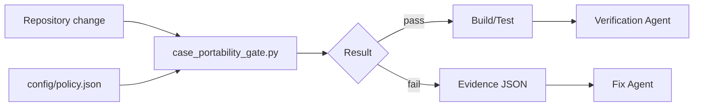

# Agent Repository Case-Sensitivity Portability Gate

A reusable deterministic gate that prevents repository path casing defects from escaping case-insensitive developer machines and failing on case-sensitive Linux CI, containers, build agents, or production hosts.

## Problem

Repositories created on Windows or default macOS filesystems can accidentally contain or reference paths whose casing is inconsistent. Typical failures include two tracked paths that collapse to the same case-insensitive name, a case-only rename that Git does not materialize as intended, or a relative JavaScript/TypeScript import whose spelling does not match the tracked path. These defects often appear only after CI or deployment moves the code to Linux.

## Purpose

This package gives AI coding agents and human workflows a fail-closed portability gate before completion. It scans tracked paths, checks case-fold collisions, validates relative JS/TS module references, and emits structured evidence that can be verified independently.

## When to use

Use after file creation, rename, refactoring, generated-code updates, dependency migrations that rewrite imports, or before commit/PR completion.

Do not use this gate as a substitute for build/test execution. It only proves the casing invariants it checks.

## Architecture



## Package tree

```text
agent-repository-case-sensitivity-portability-gate/
├── README.md
├── config/
│   └── policy.json
├── examples/
│   └── expected-report.json
├── hooks/
│   ├── post-edit.md
│   └── pre-complete.md
├── rules/
│   └── repository-case-safety.md
├── schemas/
│   └── report.schema.json
├── scripts/
│   ├── case_portability_gate.py
│   └── verify_package.py
├── skills/
│   ├── diagnose-case-defect.md
│   └── repair-case-defect.md
├── subagents/
│   ├── repository-portability-reviewer.md
│   └── verification-agent.md
├── tests/
│   └── test_case_portability_gate.py
└── workflows/
    └── case-portability-gate.md
```

## Requirements

- Python 3.10+
- Git is recommended. If Git is unavailable, the scanner can fall back to filesystem discovery.
- No third-party Python package is required.

## Configuration

`config/policy.json` defines ignored directories, source extensions scanned for relative module references, candidate module extensions, and whether unresolved relative imports should block completion.

The default policy is conservative: tracked-path case collisions and case-mismatched relative imports are blocking; unresolved imports are reported but do not fail because bundlers and aliases can resolve them outside the scanner's model.

## Usage

Run at repository root:

```bash
python path/to/scripts/case_portability_gate.py \
  --root . \
  --policy path/to/config/policy.json \
  --output .artifacts/case-portability-report.json
```

Exit codes:

| Code | Meaning |
|---:|---|
| 0 | Gate passed |
| 2 | Blocking casing defect found |
| 4 | Invalid configuration or repository input |
| 5 | Internal scanner failure |

## What is checked

1. **Tracked path collision** — two or more paths become identical after Unicode normalization and case folding.
2. **Directory-segment collision** — conflicting casing exists at any path prefix.
3. **Relative JS/TS import casing** — a relative `import`, dynamic `import()`, `export ... from`, or `require()` resolves only when casing is ignored but does not match the tracked path exactly.
4. **Unresolved relative imports** — reported as warnings by default; can be configured as blocking.

## Approval boundaries

This gate never performs renames, deletes files, rewrites Git history, commits, or pushes. A repair workflow must obtain explicit human approval before a destructive rename, mass generated-file rewrite, breaking public contract change, or Git history rewrite. Normal non-destructive source edits remain governed by the parent repository workflow.

## Failure and recovery

- Invalid policy or root: stop with exit code `4`.
- Scanner internal error: stop with exit code `5`; never mark the repository portable.
- Blocking collision or mismatch: preserve the JSON report, repair the smallest affected path/reference set, then rerun.
- Repeated repair failure: maximum 2 repair cycles before escalation to a human reviewer.
- Git unavailable: filesystem fallback is allowed, but the report records that tracked-file fidelity was unavailable.

## Verification

Run:

```bash
python scripts/verify_package.py
```

This validates package files and JSON, runs unit tests, and checks a clean synthetic repository plus deliberate collision/import mismatch fixtures.

## Definition of Done

The portability task is verified only when:

1. Scanner input and policy are valid.
2. No blocking case-fold path collision exists.
3. No blocking relative import casing mismatch exists.
4. The final report status is `pass`.
5. Required build/tests from the parent task also pass.
6. No approval-required destructive action was performed without explicit approval.
7. Remaining non-blocking unresolved imports are documented if present.

`Gate passed` is not equivalent to `application verified`; normal build, test, and task acceptance criteria remain mandatory.

## Portability

The workflow is agent-neutral and can be used from Codex, Claude Code, Cursor, ChatGPT, GitHub Copilot, OpenCode, CI scripts, or human-driven repositories. Tool-specific integration should only wrap the deterministic script; do not duplicate the core policy in prompts.