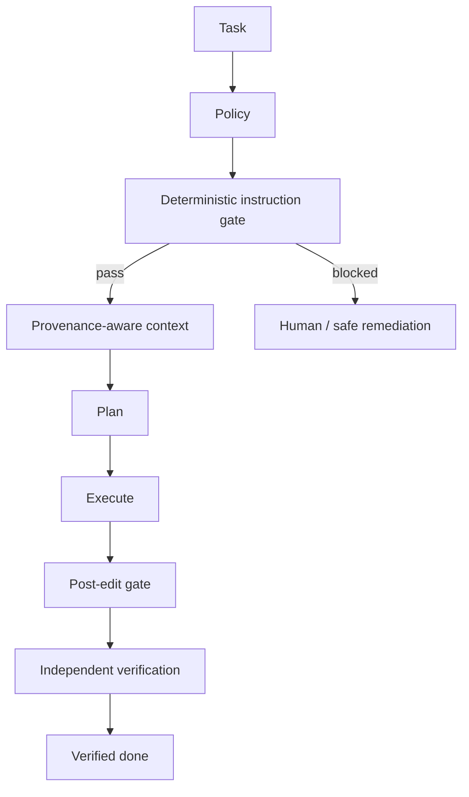

# Agent Repository Instruction Trust Gate

A reusable safety kit for coding agents that must work inside repositories containing a mix of legitimate agent instructions and untrusted instruction-like text in logs, fixtures, generated artifacts, dependencies, copied issues, documentation examples, or user-controlled files.

## Problem
Repository-aware agents often ingest large amounts of text. Imperative text inside ordinary data can be mistaken for operating instructions, causing prompt-injection-style behavior, secret exposure, unsafe commands, permission escalation, or scope drift. This kit establishes explicit provenance boundaries and a deterministic pre/post-edit scanner.

## When to use
Use before repository exploration, coding, code review, incident analysis, test generation, or autonomous maintenance where repository content may be partially untrusted. Do not use it as a malware scanner, secret scanner, or substitute for OS/container isolation.

## Architecture


## Package tree
```text
agent-repository-instruction-trust-gate/
├── README.md
├── config/policy.yaml
├── examples/task-context.json
├── hooks/lifecycle-hooks.md
├── rules/repository-instruction-safety.md
├── schemas/task-context.schema.json
├── scripts/instruction_gate.py
├── skills/build-safe-context.md
├── skills/classify-repository-instructions.md
├── subagents/repository-trust-reviewer.md
├── subagents/verification-agent.md
├── templates/task-context.json
├── tests/test_instruction_gate.py
└── workflows/safe-repository-task.md
```

## Components
`policy.yaml` defines explicit trusted instruction paths, untrusted path patterns, suspicious patterns, size limits, and blocking behavior. `instruction_gate.py` scans text deterministically and emits JSON evidence. Skills define classification and safe context construction. The trust reviewer owns provenance decisions; the verification agent independently checks completion. Lifecycle hooks bind the gate to pre-task, post-edit, and final verification stages.

## Installation
Requires Python 3.9+ and PyYAML. From the package root run `python -m pip install pyyaml`. No network access is required at runtime. Copy the package into a repository or adapt the paths in your agent configuration.

## Configuration
Edit `config/policy.yaml`. Keep `trusted_instruction_paths` intentionally small. Add only files whose repository governance makes them authoritative. Path patterns are evaluated relative to repository root. Suspicious regexes are signals, not a semantic security proof; tune them to your environment while preserving the trust boundary.

## Permissions
The scanner needs read access to the repository and write access only to its report path. It does not require secrets, network access, production credentials, Git write permission, or elevated OS privileges.

## Usage
Run from this package directory against a target repository:

```bash
python scripts/instruction_gate.py --root /path/to/repo --policy config/policy.yaml --output instruction-gate-report.json
python -m unittest tests/test_instruction_gate.py
```

Exit codes: `0` pass, `1` blocked suspicious untrusted content, `2` configuration/tool error.

For an agent task, copy `templates/task-context.json`, validate it against `schemas/task-context.schema.json` in your preferred JSON Schema validator, then follow `workflows/safe-repository-task.md`.

## Workflow
The trust reviewer runs preflight and classifies sources. Context construction reads trusted instructions first, then task-relevant code/tests strictly as evidence. Planning cannot promote untrusted text into authority. Execution is bounded to the task. The scanner reruns after edits. An independent verifier checks the diff, scan result, tests/build evidence, and approvals.

## Approval boundaries
Explicit human approval is mandatory before trusting a new instruction source and before production deployment, destructive SQL, schema changes, data/file deletion, force push/history rewrite, infrastructure changes, secret changes, production configuration changes, breaking API contracts, weakened security controls, irreversible migrations, or large dependency upgrades. The workflow stops rather than silently increasing permissions.

## Failure and recovery
Transient read/tool failures may retry at most twice. Implementation-caused build/test failures permit at most two fix-test cycles. Scanner blocks are not retried without a content change or explicit human policy decision. Permission failures never trigger privilege escalation. Every failure preserves the report, command output, and relevant file/line evidence.

## Verification
A task is executed when edits/actions have occurred. It is verified only when the final scanner passes or approved exceptions are documented, relevant project checks pass, the diff contains no unintended changes, the output contract is satisfied, required approvals exist, and the independent verification agent returns `verified`.

## Definition of Done
- Trusted instruction sources are explicit and provenance is preserved.
- Suspicious repository content is dispositioned and never silently promoted to authority.
- Requested artifacts/changes exist and remain in scope.
- Relevant formatting, tests, build, and project checks pass.
- Dangerous actions have explicit approval or were not performed.
- Independent verification succeeds.
- Remaining non-blocking risks are documented and no blocking failure remains.

## Customization
Add organization-specific trusted files and suspicious patterns, integrate the pre/post hooks into your coding-agent lifecycle, and add project-specific build/test commands after the post-edit gate. Keep core trust classification tool-neutral so the same package can govern Codex, Claude Code, Cursor, ChatGPT, Copilot, OpenCode, or other agents without assuming unsupported capabilities.