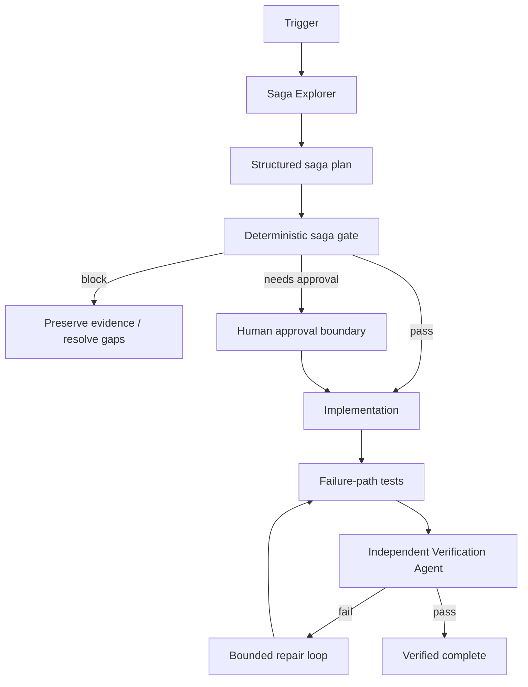

# Agent Saga Compensation Consistency Gate

Reusable AI engineering kit for distributed workflows where one business operation spans multiple transactional boundaries and partial failure can leave systems inconsistent.

## Problem

A multi-step workflow can succeed partially: inventory is reserved, payment is captured, a queue message is published, or a remote API commits before a later step fails. A database rollback cannot undo every external side effect. Blind retries can duplicate effects, while naive rollback logic can create a second inconsistency.

This package makes saga analysis, compensation design, retry boundaries, uncertain-outcome reconciliation, approvals, and verification explicit and reusable.

## Purpose

Use the kit to help an AI coding agent or developer:

- map actual commit order and side effects;
- identify idempotency and unknown-outcome risks;
- require compensation or an evidenced non-compensable reason;
- design bounded compensation/reconciliation behavior;
- block unsafe retries;
- require human approval for destructive or irreversible repair;
- independently verify forward and failure paths.

## When to use

Use when a feature, incident, refactor, or integration spans multiple databases, queues, HTTP APIs, payment/inventory/order systems, background jobs, or other resources that cannot participate in one atomic transaction.

## When not to use

Do not introduce a saga when the operation already fits safely inside one local transaction, when eventual inconsistency is explicitly acceptable without remediation, or when business semantics for compensation are unknown and no domain owner/evidence is available.

## Architecture



## Package tree

```text
agent-saga-compensation-consistency-gate/
├── README.md
├── config/
│   └── policy.yaml
├── examples/
│   └── saga-plan.json
├── hooks/
│   └── lifecycle.md
├── rules/
│   └── saga-safety.md
├── schemas/
│   └── saga-result.schema.json
├── scripts/
│   ├── saga_gate.py
│   └── verify_package.py
├── skills/
│   ├── compensation-design.md
│   └── saga-assessment.md
├── subagents/
│   ├── saga-explorer.md
│   └── verification-agent.md
├── tests/
│   └── test_saga_gate.py
└── workflows/
    └── saga-compensation-workflow.md
```

## Component responsibilities

- `skills/saga-assessment.md` traces the real flow and builds an evidence-backed step map.
- `skills/compensation-design.md` defines semantic compensation, reconciliation, ordering, retries, and test expectations.
- `rules/saga-safety.md` contains mandatory, forbidden, and preferred behavior.
- `subagents/saga-explorer.md` owns context collection without production mutation.
- `subagents/verification-agent.md` independently verifies the implementation.
- `workflows/saga-compensation-workflow.md` defines the bounded end-to-end process.
- `hooks/lifecycle.md` defines deterministic pre-task, post-edit, and final checks.
- `scripts/saga_gate.py` evaluates a structured saga plan against policy.
- `scripts/verify_package.py` confirms required package files exist and checks for omitted-implementation placeholders.
- `config/policy.yaml` contains reusable limits and approval boundaries.
- `schemas/saga-result.schema.json` defines the gate result contract.
- `examples/saga-plan.json` is a copyable example input.
- `tests/test_saga_gate.py` self-tests the deterministic gate.

## Installation

Copy this directory into the target repository. Python 3.9+ is recommended. Install the only external script dependency:

```bash
python -m pip install pyyaml
```

No agent-specific SDK is required.

## Configuration

Edit `config/policy.yaml` only where project policy differs. Important defaults:

- maximum 20 saga steps;
- maximum 3 compensation attempts;
- retryable side effects must be idempotent;
- side effects require compensation or an evidenced non-compensable reason;
- compensation order defaults to reverse committed order;
- destructive compensation, irreversible steps, production data repair, and manual balance changes require human approval.

Do not weaken these controls merely to make the gate pass.

## Permissions

The investigation phase requires repository read/search access, test execution, and optionally read-only logs/traces. Production deployment, destructive SQL, schema changes, data deletion, secret/config changes, irreversible repair, and other dangerous actions remain human approval boundaries.

## Usage

Start from the example and replace it with the real operation:

```bash
cp examples/saga-plan.json /tmp/my-saga.json
python scripts/saga_gate.py \
  --input /tmp/my-saga.json \
  --policy config/policy.yaml \
  --output /tmp/saga-result.json
```

Exit codes:

- `0`: `pass` or `needs-approval` structural result;
- `2`: blocked by safety findings;
- `3`: input/tool/configuration error.

A `needs-approval` result is not permission to execute the dangerous action. The workflow must stop at the approval boundary.

Run package self-tests and verification from the package root:

```bash
python -m unittest tests/test_saga_gate.py
python scripts/verify_package.py
```

## Example invocation for an AI coding agent

Use `skills/saga-assessment.md` first. Provide the target use case and ask the agent to create a structured plan from repository evidence. Then run the deterministic gate. Only after the plan is complete should the implementation agent apply the smallest safe change using `skills/compensation-design.md`. Final success requires an independent pass using `subagents/verification-agent.md`.

## Workflow

The canonical workflow is `workflows/saga-compensation-workflow.md`:

1. gather context;
2. map side effects and atomic boundaries;
3. define idempotency, compensation, reconciliation, and approvals;
4. run the deterministic gate;
5. implement the smallest safe change;
6. test success, duplicate, timeout, crash, partial failure, compensation retry, and resume paths;
7. inspect the diff;
8. independently verify;
9. complete only with evidence.

Automatic retries are bounded. Tool/test infrastructure failures may retry twice. Compensation attempts are capped by `max_compensation_attempts` (default 3). Business-rule failures do not retry automatically.

## Approval boundaries

Explicit approval is required before destructive compensation, irreversible business actions, production data repair, manual financial/balance adjustment, production deployment, schema changes, data deletion, force push/history rewrite, security weakening, secret changes, or other irreversible operations.

Agents must not increase privileges or bypass an approval boundary to unblock the workflow.

## Failure handling

- **Transient tool/test failure:** preserve evidence and retry at most twice.
- **Validation failure:** fix the plan or implementation; do not retry unchanged input.
- **Unknown remote outcome:** reconcile using receipt/status/query evidence before compensating or retrying.
- **Compensation failure:** preserve receipts and errors, retry within the configured budget, then escalate.
- **Permission/environment failure:** stop without privilege escalation.
- **Business-rule failure:** do not automatically retry.
- **Approval-required action:** stop with `needs-approval`.

Repeated failures must leave useful evidence rather than ending with an ambiguous “failed” state.

## Verification

A task being executed is not the same as being verified. Final verification should prove:

- every externally visible side effect is represented;
- retryable side effects have an idempotency mechanism;
- each side effect has compensation or an evidenced non-compensable reason;
- uncertain outcomes have reconciliation behavior;
- compensation ordering is valid;
- failure-path tests pass;
- no required approval is missing;
- the deterministic gate passes;
- the final diff contains no unintended changes;
- the independent verifier records evidence.

## Definition of Done

The package-specific Definition of Done is satisfied only when all of the following are true:

- required context is gathered;
- all side effects and transaction boundaries are mapped;
- compensation/reconciliation semantics are explicit;
- retry and compensation loops are bounded;
- approval-required actions remain blocked until approved;
- required implementation and tests exist;
- forward and failure-path tests pass;
- deterministic gate output is valid;
- independent verification succeeds;
- no unresolved unknown outcome or blocking finding remains;
- remaining risks are documented.

## Customization

Adapt policy values and domain-specific test commands, but keep the core flow tool-neutral. Codex, Claude Code, Cursor, ChatGPT, GitHub Copilot, OpenCode, or another agent can follow the same Skills, Rules, Workflow, and contracts. Tool-specific adapters should be added outside the core package unless they materially improve the workflow.
