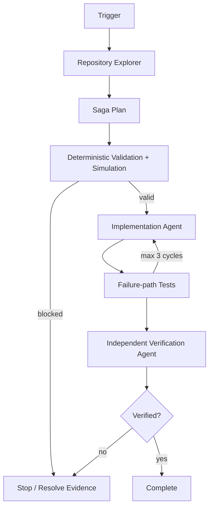

# Agent Saga Compensation Safety Gate

A reusable implementation kit for AI coding agents that modify or verify distributed workflows where partial success, retries, ambiguous external outcomes, and compensation can cause duplicate or destructive side effects.

## Problem
Multi-step workflows often cross database, queue, service, payment, storage, or provisioning boundaries. A local transaction can succeed while a later step fails, an acknowledgement can be lost after an external action succeeds, or compensation itself can fail. Naive agents may retry blindly, double-execute non-idempotent operations, or report rollback even when business state remains partially applied.

## Purpose
Turn saga recovery into an evidence-based workflow: map side effects, require idempotency and compensation contracts, validate the plan deterministically, implement the smallest safe change, test bounded failure windows, and require independent verification.

## When to use
Use for multi-service feature work, order/payment/provisioning flows, background orchestration, integration jobs, retry logic, incident remediation, and any workflow with partial-success risk.

## When not to use
Do not use this kit as a production orchestrator, database migration runner, deployment system, or substitute for domain-specific transactional guarantees. It never performs production compensation automatically.

## Architecture


## Package tree
```text
agent-saga-compensation-safety-gate/
├── README.md
├── config/policy.yaml
├── examples/order-saga-plan.json
├── hooks/lifecycle-hooks.md
├── rules/saga-safety-rules.md
├── schemas/saga-plan.schema.json
├── scripts/validate_saga.py
├── skills/map-saga-boundaries.md
├── skills/verify-recovery.md
├── subagents/implementation-agent.md
├── subagents/repository-explorer.md
├── subagents/verification-agent.md
├── tests/test_validate_saga.py
└── workflows/saga-recovery-workflow.md
```

## Component responsibilities
- `skills/map-saga-boundaries.md` defines evidence-first discovery and plan creation.
- `scripts/validate_saga.py` deterministically enforces core plan safety requirements and simulates reverse-order compensation.
- `rules/saga-safety-rules.md` defines mandatory, forbidden, and preferred behavior.
- Repository Explorer maps the workflow without editing.
- Implementation Agent owns the smallest safe change.
- Verification Agent independently decides whether recovery behavior is actually verified.
- `workflows/saga-recovery-workflow.md` defines bounded retries, approvals, failure paths, outputs, and Definition of Done.
- `hooks/lifecycle-hooks.md` provides predictable pre-task, post-edit, and final-verification gates.

## Installation
Copy this directory into a repository. Requirements: Python 3.9+ for deterministic validation and the repository's normal build/test tooling. No third-party Python packages are required.

On Unix, optionally make the validator executable:
```bash
chmod +x scripts/validate_saga.py
```

## Configuration
`config/policy.yaml` documents the standard retry and approval policy. The reference validator enforces the core plan contract; adapt it if your repository needs stricter domain-specific fields. Default retry limits are two operational retries, two compensation retries, and at most three implementation/test-fix cycles in the workflow.

## Permissions
Core investigation requires repository read access. Implementation needs local repository write access and test execution. This package does not require production, infrastructure, secret-management, destructive database, registry, or Git-history-rewrite permissions.

## Usage
Validate the included example:
```bash
python scripts/validate_saga.py examples/order-saga-plan.json --simulate
```

Write validation evidence:
```bash
mkdir -p .saga
python scripts/validate_saga.py path/to/saga-plan.json --simulate --out .saga/plan-validation.json
```

Run deterministic tests:
```bash
python -m unittest tests/test_validate_saga.py
```

## Example invocation for an AI coding agent
Use `skills/map-saga-boundaries.md` to trace the target workflow, materialize a saga plan matching `schemas/saga-plan.schema.json`, validate it with `scripts/validate_saga.py`, then follow `workflows/saga-recovery-workflow.md`. Do not execute production side effects. The implementing agent cannot be the only final verifier.

## Workflow
The required flow is: Trigger → Context → Saga map → Plan → Deterministic validation/simulation → Minimal implementation → Failure-path tests → Diff review → Independent verification → Complete.

## Approval boundaries
Explicit human approval is required before destructive compensation, irreversible external action, schema or infrastructure change, secret change, production configuration change, breaking API contract, security weakening, large dependency upgrade, production deployment, or any data/file deletion. Agents stop before such actions.

## Failure handling
Transient environment or tool failures may be retried at most twice while preserving evidence. Deterministic validation or invariant failures are not blindly retried. Implementation/test-fix cycles are capped at three. Ambiguous external outcomes must be reconciled before replay. Compensation failures preserve state and evidence and are retried only within policy limits.

## Verification
`Task executed` means code or artifacts were produced. `Task verified successfully` requires a valid current saga plan, passing relevant success and failure-path tests, bounded idempotent retries/compensations, reconciliation for ambiguous outcomes, required approvals, clean/reviewed diff, and independent verification status `verified`.

## Definition of Done
- Target workflow and business invariant are identified.
- Every material side effect and dependency is mapped.
- Every reversible side effect has a stable idempotency key and concrete compensation.
- Ambiguous completion windows have an outcome-reconciliation strategy.
- Deterministic plan validation passes.
- Relevant success, duplicate, timeout/ambiguous, downstream-failure, compensation, and repeated-compensation tests pass where applicable.
- Retry and compensation attempts remain within policy limits.
- Approval-required actions are not executed without approval.
- No unrelated changes remain.
- Independent verifier reports `verified` and remaining risks are documented and non-blocking.

## Customization
Add domain-specific plan fields, invariants, or deterministic checks without moving deterministic policy into vague agent prose. Keep tool-specific adapters separate from the core skills/rules/workflow so the package remains usable with Codex, Claude Code, Cursor, ChatGPT, GitHub Copilot, OpenCode, and other coding agents.
