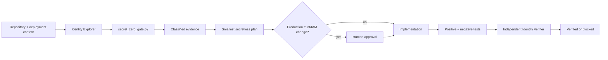

# Agent Secret-Zero Bootstrap Gate

Reusable AI engineering kit for preventing the **secret-zero problem**: a workload needs credentials to fetch credentials, so teams or coding agents fall back to committed client secrets, copied API keys, long-lived CI variables, or production credentials pasted into troubleshooting context.

## Problem and purpose
A service may correctly use a secret manager after startup yet still depend on a static credential to authenticate to that manager or identity provider. This package makes the first credential path explicit, scans repositories without printing values, guides migration toward workload identity/OIDC federation/managed identity, separates authentication from authorization, and requires independent verification.

## When to use
Use for cloud/service onboarding, CI/CD identity changes, secret-manager adoption, 401/403 investigations, credential-rotation preparation, identity-provider migration, or PRs that add/change credential providers.

Do not use it to rotate/delete production secrets automatically, administer IAM, validate JWT signatures, or replace provider-supported authentication libraries.

## Architecture


## Package tree
```text
agent-secret-zero-bootstrap-gate/
├── README.md
├── config/policy.json
├── examples/verification-result.json
├── hooks/lifecycle.md
├── rules/secret-zero-safety.md
├── schemas/verification-result.schema.json
├── scripts/secret_zero_gate.py
├── skills/bootstrap-investigation.md
├── skills/secretless-migration-review.md
├── subagents/identity-explorer.md
├── subagents/identity-verifier.md
├── templates/finding.md
├── tests/test_secret_zero_gate.py
└── workflows/secret-zero-bootstrap-gate.md
```

## Installation and dependencies
Python 3.10+ only; the scanner uses the standard library. Git is optional but preferred because the scanner then limits inspection to tracked files.

## Configuration
Edit `config/policy.json`. Keep allowed bootstrap mechanisms aligned with your platform. File/name patterns are heuristic detectors, not proof that a credential is active. Never add actual secrets to policy or examples.

## Permissions
Normal execution needs repository read access and permission to run local/CI tests. An implementation agent may need repository write access. It does **not** need production secret values, secret-store administration, IAM administration, or production configuration write access. Those boundaries must not be expanded automatically.

## Usage
From the package root, scan a target repository:
```bash
python scripts/secret_zero_gate.py --root /path/to/repo --policy config/policy.json --environment production --output secret-zero-result.json
```
Exit codes: `0` pass/non-blocking, `2` blocking finding, `3` invalid input/configuration. Findings redact matched values.

Run package tests:
```bash
python -m unittest discover -s tests -v
```

Example agent invocation: “Follow `workflows/secret-zero-bootstrap-gate.md` for the payments worker in staging. Do not request raw credentials. Stop before any production identity or IAM change.”

## Component responsibilities
`skills/bootstrap-investigation.md` traces the first credential path; `skills/secretless-migration-review.md` reviews the replacement. `identity-explorer.md` is read-only; `identity-verifier.md` independently verifies. `rules/secret-zero-safety.md` defines enforceable boundaries. `scripts/secret_zero_gate.py` provides deterministic repository evidence. `hooks/lifecycle.md` defines automatic checkpoints. The schema/template standardize handoffs.

## Workflow
Follow `workflows/secret-zero-bootstrap-gate.md`: explore → scan → classify → plan → approval when needed → implement → test → independent verification. Transient tool failures retry at most twice; a semantic auth failure gets one evidenced fix-retest attempt. There are no infinite loops.

## Approval boundaries
Explicit human approval is required before production identity bindings or federation trust changes, IAM grants, secret rotation/deletion, production configuration changes, breaking authentication contracts, or weakening security controls. The agent must stop before the action; approval is not inferred from a successful test.

## Failure handling
Preserve redacted evidence. Tool/transient failures retry at most twice. Permission failures, unknown credential ownership, missing approval, or repeated auth failures stop the workflow. Never recover by pasting credentials, increasing privilege, adding an unapproved static-secret fallback, or disabling validation.

## Verification
Execution is not success. Verification requires: scanner findings classified/resolved; no raw credential values in evidence; intended identity authenticates and receives only required authorization; an unauthorized identity fails; renewal/failure behavior is tested where supported; package and relevant repository tests pass; diff has no production static-secret fallback; required approval exists; independent verifier returns `verified`.

## Definition of Done
The first credential path is explicit; production bootstrap no longer relies on an unexplained static secret; least privilege is evidenced separately from credential acquisition; positive and negative tests pass; deterministic scan/tests pass; no credential leakage occurred; approval boundaries were honored; independent verification succeeds; remaining risks are recorded.

## Customization
Map provider-specific mechanisms in configuration and application adapters: Azure Managed Identity/Workload Identity, AWS IAM roles/OIDC, GCP Workload Identity Federation, Kubernetes service-account federation, or CI OIDC. Keep provider details isolated; preserve the core rule that a secretless bootstrap must not be “fixed” by silently introducing a new long-lived secret.
