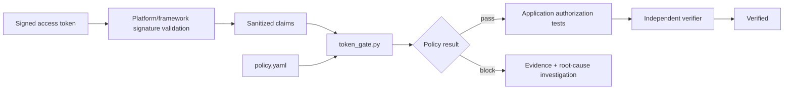

# Agent Service Token Audience & Scope Gate

Reusable AI engineering package for preventing service-to-service authentication mistakes where a structurally valid JWT is accepted for the wrong API, wrong issuer, insufficient permission, invalid lifetime, or unidentified client.

## Problem

AI-assisted integrations often diagnose 401/403 failures by decoding a token and changing configuration until the request succeeds. That is unsafe: decoding does not verify a signature, a token for another resource may look valid, and permission broadening can silently create an authorization vulnerability.

This kit separates cryptographic authentication from deterministic authorization-policy checks. The application or gateway remains responsible for signature/key validation. This package verifies sanitized claims against an explicit service policy and gives agents a bounded investigation, review, and verification workflow.

## When to use

Use for service onboarding, 401/403 investigation, client-credential integrations, delegated-token APIs, auth middleware changes, identity-provider migrations, and pull requests that change issuer/audience/scope/role checks.

Do not use this script as a JWT signature verifier or as a replacement for framework identity middleware.

## Architecture



## Package tree

```text
agent-service-token-audience-scope-gate/
├── README.md
├── config/
│   └── policy.yaml
├── examples/
│   ├── valid-claims.json
│   └── wrong-audience-claims.json
├── hooks/
│   └── lifecycle.md
├── rules/
│   └── token-validation-safety.md
├── schemas/
│   └── verification-result.schema.json
├── scripts/
│   ├── requirements.txt
│   └── token_gate.py
├── skills/
│   ├── token-policy-change-review.md
│   └── token-policy-investigation.md
├── subagents/
│   ├── auth-policy-explorer.md
│   └── auth-policy-verifier.md
├── templates/
│   └── finding.md
├── tests/
│   └── test_token_gate.py
└── workflows/
    └── service-token-policy-gate.md
```

## Installation

Requires Python 3.10+.

```bash
python -m pip install -r scripts/requirements.txt
```

## Configuration

Edit `config/policy.yaml` with the exact accepted issuer, resource audience, and least-privilege scopes or app roles for the target service. Do not put secrets in the file.

Important fields:

- `accepted_issuers`: exact issuer strings.
- `required_audiences`: accepted target-resource identifiers.
- `required_scopes`: permissions required by the operation.
- `allowed_clock_skew_seconds`: bounded lifetime tolerance.
- `require_azp_or_appid`: requires caller application identity.
- `production_requires_human_approval_for_policy_relaxation`: workflow approval boundary.

## Permissions

The normal workflow needs repository read/write access for package or application changes and permission to run tests. It does not need access to signing keys, raw production tokens, client secrets, or identity-provider administrative permissions. Any permission grant or production auth-policy relaxation requires human approval.

## Usage

Validate sanitized claims:

```bash
python scripts/token_gate.py \
  --claims-file examples/valid-claims.json \
  --policy config/policy.yaml \
  --output gate-result.json
```

Expected success exit code: `0`.

Verify a wrong-resource token is rejected:

```bash
python scripts/token_gate.py \
  --claims-file examples/wrong-audience-claims.json \
  --policy config/policy.yaml
```

Expected rejection exit code: `2` with `audience_mismatch`.

The script also accepts `--token` for local/dev troubleshooting, but using raw production tokens in agent context is forbidden by `rules/token-validation-safety.md`. The script decodes claims only; cryptographic signature verification must happen before this gate.

Run package tests:

```bash
python -m unittest discover -s tests -v
```

## Workflow

Follow `workflows/service-token-policy-gate.md`:

1. `subagents/auth-policy-explorer.md` gathers repository and configuration evidence.
2. Plan the expected issuer, audience, permission model, lifetime, and client identity checks.
3. Implement the smallest evidenced change.
4. Run deterministic positive and negative claim checks.
5. Run unit/integration tests.
6. `subagents/auth-policy-verifier.md` independently verifies the result.
7. Stop for approval if production security policy would be relaxed.

The detailed procedures are in `skills/token-policy-investigation.md` and `skills/token-policy-change-review.md`.

## Approval boundaries

Explicit human approval is required before production issuer/audience broadening, disabling required claims, increasing clock skew materially, adding privileged scopes/roles, changing identity-provider trust, changing secrets, weakening signature validation, or modifying a breaking authentication contract. The agents must not self-grant permissions or silently weaken controls.

## Failure and recovery

Transient repository, documentation, or tool failures may retry at most twice per workflow stage. Semantic validation failures, permission failures, wrong-resource tokens, and missing scopes are not retryable without an evidenced change. A test-fix-retest loop is limited to one fix attempt for the same hypothesis. Evidence is preserved before escalation.

## Verification

Successful execution is not sufficient. Verification requires:

- Signature/key validation remains enabled in the platform/framework boundary.
- Correct issuer and intended audience pass.
- Wrong issuer and wrong audience fail.
- Missing required scope/role fails.
- Expired and not-yet-valid tokens fail.
- Missing caller identity fails where required.
- `python -m unittest discover -s tests -v` passes.
- Relevant repository auth tests pass.
- Independent verifier returns `verified`.
- Required human approval exists for any production policy relaxation.

Use `schemas/verification-result.schema.json` for structured handoffs and `templates/finding.md` for human-readable findings.

## Definition of Done

The task is done only when expected trust boundaries are explicit, deterministic checks and application tests pass, required negative cases reject, no raw secrets/tokens are stored, no unintended permission broadening occurred, required approvals are present, independent verification succeeds, and remaining risks are documented.

## Customization

For Azure AD/Entra ID, map delegated permissions from `scp` and application permissions from `roles`. For other providers, adapt claim names at the application boundary or extend `scripts/token_gate.py` while preserving exact issuer/audience matching and independent signature verification. Keep provider-specific differences isolated to configuration or claim adapters rather than weakening the core rules.
