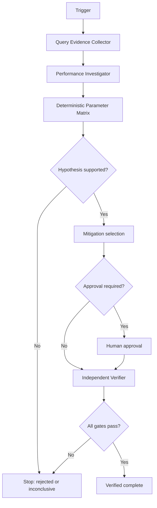

# Agent SQL Parameter Sniffing Regression Gate

Reusable AI-engineering package for diagnosing and safely mitigating SQL Server parameter-sensitive plan regressions with evidence, bounded retries, deterministic benchmarking, independent verification, and explicit approval boundaries.

## Problem
The same parameterized query can reuse a plan compiled for a very different parameter distribution. This may create intermittent latency spikes, excessive reads, poor joins, spills, or unstable production behavior. Slow execution alone is not proof, so the package forces comparison across representative parameter classes and competing root causes.

## When to use
Use when one logical SQL query is fast for some values and slow for others, after a plan change/recompile/deployment, or when Query Store/telemetry suggests multiple materially different performance profiles for the same query.

## When not to use
Do not use this package as a generic database tuning shortcut. Blocking, resource saturation, missing indexes, stale statistics, changed data volume, network latency, or query-shape changes must remain competing explanations until evidence rules them out.

## Architecture


## Package tree
```text
agent-sql-parameter-sniffing-regression-gate/
├── README.md
├── config/
│   └── policy.yaml
├── hooks/
│   └── lifecycle.md
├── rules/
│   └── sql-parameter-sniffing-safety.md
├── schemas/
│   └── benchmark-result.schema.json
├── scripts/
│   ├── benchmark_parameter_sets.py
│   └── verify_package.py
├── skills/
│   ├── mitigation-selection.md
│   └── parameter-sniffing-investigation.md
├── subagents/
│   ├── independent-verifier.md
│   ├── performance-investigator.md
│   └── query-evidence-collector.md
├── templates/
│   └── parameter-matrix.json
├── examples/
│   └── parameter-cases.json
├── tests/
│   └── test_benchmark_parameter_sets.py
└── workflows/
    └── investigate-and-mitigate.md
```

## Component responsibilities
- `skills/parameter-sniffing-investigation.md`: evidence-driven diagnosis procedure.
- `skills/mitigation-selection.md`: selects the smallest reversible candidate mitigation.
- `rules/sql-parameter-sniffing-safety.md`: enforceable repository, database, evidence, and approval rules.
- `subagents/query-evidence-collector.md`: read-only repository/database evidence gathering.
- `subagents/performance-investigator.md`: hypothesis testing and mitigation design.
- `subagents/independent-verifier.md`: independent re-test and completion gate.
- `workflows/investigate-and-mitigate.md`: bounded end-to-end orchestration.
- `hooks/lifecycle.md`: pre-task, pre-benchmark, post-benchmark, and final checks.
- `scripts/benchmark_parameter_sets.py`: deterministic parameter-class benchmark runner.
- `scripts/verify_package.py`: package integrity check.
- `config/policy.yaml`: thresholds, retry budget, and approval boundaries.
- `schemas/benchmark-result.schema.json`: structured benchmark result contract.
- `templates/parameter-matrix.json`: reusable input template.
- `examples/parameter-cases.json`: sample parameter matrix.
- `tests/test_benchmark_parameter_sets.py`: unit tests for deterministic command rendering.

## Installation
Requires Python 3.10+ and only the Python standard library for package scripts/tests. Copy this directory into a repository. No database driver is forced: the benchmark runner executes a user-supplied read-only command template, so teams can use `sqlcmd`, `dotnet`, PowerShell, a project-specific harness, or another approved SQL client.

Run package validation:
```bash
python scripts/verify_package.py
python -m unittest tests/test_benchmark_parameter_sets.py
```

## Configuration
Edit `config/policy.yaml` to match repository SLOs. Defaults block or require review around 2x latency regression, 2-second absolute latency, bounded two-attempt retries, and all database-changing mitigations.

The benchmark script intentionally does not read secrets or connect to SQL itself. Database credentials remain in the approved caller/tooling environment. Never put connection strings or credentials in parameter-case JSON files.

## Usage
1. Copy `templates/parameter-matrix.json` and populate representative low/typical/high selectivity classes.
2. Perform a dry run to inspect rendered commands:
```bash
python scripts/benchmark_parameter_sets.py \
  --cases parameter-matrix.json \
  --command "your-read-only-runner --value {value}" \
  --dry-run
```
3. Execute the matrix in a non-production or explicitly read-only environment:
```bash
python scripts/benchmark_parameter_sets.py \
  --cases parameter-matrix.json \
  --command "your-read-only-runner --value {value}" \
  --runs 5 \
  --output benchmark-result.json
```
4. Apply `skills/parameter-sniffing-investigation.md` to separate facts, hypotheses, decisions, evidence, and open questions.
5. If parameter-sensitive plan reuse is supported, rank candidates via `skills/mitigation-selection.md`.
6. Stop for approval before any query hint, forced plan, index/schema change, database-scoped setting, or production-changing action.
7. The Independent Verifier repeats the same matrix and relevant correctness tests before status can become verified.

The command executed by the benchmark runner should print JSON when possible:
```json
{"rows": 1250, "plan_hash": "plan-a", "note": "optional safe note"}
```
If it prints non-JSON output, timing is still captured but plan/row evidence is limited.

## Workflow and retry behavior
The workflow is Evidence → Hypothesis → Benchmark → Mitigation → Approval when required → Independent Verification → Complete. Transient connection/timeouts and unstable benchmark attempts may retry at most twice. Permission, safety, invalid-input, and business-rule failures do not retry blindly. All failed-run evidence must be preserved.

## Approval boundaries
Explicit human approval is required before production deployment, plan forcing, query hints that change optimizer behavior, index/schema changes, database-scoped configuration, destructive SQL, plan-cache clearing, breaking API changes, secret/config changes, or irreversible migrations. The package never silently increases privileges.

## Verification
A task is executed when the benchmark/workflow ran. It is verified successfully only when:
- at least two materially different parameter classes reproduce the diagnosis;
- competing explanations were evaluated;
- required correctness/build/tests pass for any code change;
- verifier reruns stay within configured regression thresholds;
- approval-required actions have recorded approval;
- no unintended production/database changes occurred;
- residual risks and missing evidence are documented.

## Failure handling
Connection and timeout failures preserve stdout/stderr and retry at most twice. Invalid inputs, permission failures, unsafe production state, missing approval, or repeated instability stop execution. A failed mitigation may be revised at most twice in one run; after that the workflow escalates with evidence instead of looping.

## Definition of Done
- Required repository/query context is gathered.
- Representative parameter classes exist.
- Diagnosis is evidence-backed or explicitly rejected/inconclusive.
- Deterministic benchmark artifacts exist.
- Candidate mitigation is reversible and scoped.
- Independent verification completed.
- Required approvals are present.
- Remaining risks are documented.
- No blocking failure is hidden.

## Portability
The workflow and contracts are tool-neutral and can be used with Codex, Claude Code, Cursor, ChatGPT, GitHub Copilot, OpenCode, or other coding agents. Tool-specific SQL/database access should remain outside core instructions and must honor the same read-only and approval rules.
