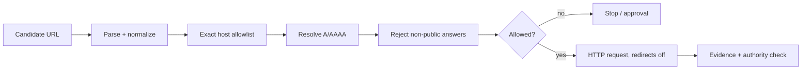

# Agent SSRF Egress Policy Gate

A reusable fail-closed gate that prevents AI agents from turning user-controlled, repository-derived, retrieved, or model-generated URLs into server-side request forgery (SSRF), cloud metadata access, internal-network probing, redirect-based credential leakage, or DNS-rebinding-style egress.

## Problem and trigger
Agents routinely receive URLs from tickets, logs, documents, APIs, MCP tools, and generated plans. A normal HTTP client can follow those URLs into loopback, RFC1918, link-local/cloud metadata, IPv6 local ranges, or a redirect to an internal service. Use this kit immediately before any data-derived outbound HTTP request.

Do not use it as a general firewall or as authorization for arbitrary Internet access. Hard-coded first-party service clients should still have their own network policy.

## Architecture



The independent Egress Verifier cannot perform the network request or edit policy. The caller executes only after deterministic validation succeeds.

## Package tree

```text
agent-ssrf-egress-policy-gate/
├── README.md
├── config/policy.yaml
├── hooks/pre-egress.md
├── rules/egress-safety.md
├── scripts/validate-url.py
├── skills/assess-egress-request.md
├── subagents/egress-verifier.md
├── tests/test_validate_url.py
└── workflows/validate-before-egress.md
```

## Installation
Requires Python 3.10+ and PyYAML. For tests, install pytest. Copy the directory into a repository and edit only `config/policy.yaml` to enumerate destinations the application truly needs.

```bash
python -m pip install pyyaml pytest
python scripts/validate-url.py https://api.github.com --policy config/policy.yaml
pytest -q tests/test_validate_url.py
```

## Configuration
`allowed_hosts` is exact-match and intentionally narrow. `blocked_cidrs` covers common non-public IPv4/IPv6 ranges; the script additionally requires `ipaddress.is_global`, so omitted special-use ranges still fail closed. `max_redirects: 0` expresses the default no-redirect contract. The current validator does not make HTTP requests; callers must configure their client to disable automatic redirects.

The sample allowlist contains `api.github.com` and `api.openai.com` only as configuration examples. Remove services the consuming repository does not use. Adding a hostname is an approval-required security change.

## Usage
Before a network tool call, follow `skills/assess-egress-request.md` and `workflows/validate-before-egress.md`. The pre-egress hook invokes the validator. Exit code 0 permits the caller to proceed to the exact validated authority; any other code blocks execution.

Example:

```bash
TARGET_URL=https://api.github.com/repos/openai/openai
python scripts/validate-url.py "$TARGET_URL"
```

## Permissions and approval boundaries
The verifier needs repository read access and DNS resolution only. It must not receive application secrets. Human approval is required to add a new host, enable redirects, or authorize a new credential class for a host. Private/reserved network access, metadata-service access, security weakening, and credential forwarding to an unapproved authority are denied rather than approvable shortcuts.

## Failure and recovery
URL parse/policy errors are non-retryable. A transient DNS resolver failure may be retried once; preserve the original evidence. A non-allowlisted public host stops as `approval_required`. Any non-global DNS answer stops as `deny`. Repeated failure ends the workflow; never retry until success or widen policy automatically.

## Verification
Run the tests and then validate every configured allowlisted host in the deployment environment, because DNS answers are environment-dependent. Verify the real HTTP client has redirects disabled and that each retry re-enters the pre-egress gate. Review the final diff for newly added hosts, removed CIDRs, scheme changes, or redirect changes.

Task execution means the validator ran. Verified success means the effective destination passed immediately before use, the connection remained on the validated authority, tests passed, and no credential or redirect crossed the boundary.

## Definition of Done
The package is complete when policy loads, tests pass, required external hosts are explicitly allowlisted, private/special-use IPs are denied for IPv4 and IPv6, DNS is checked immediately before egress, automatic redirects are disabled, approval boundaries are enforced, and sanitized evidence can explain each decision.

## Customization
Centralize this gate in a shared HTTP adapter or egress proxy when multiple agents exist. If redirect support is genuinely required, implement hop-by-hop validation rather than increasing `max_redirects` alone. For high-assurance deployments, enforce the same destination policy at the network layer so application-level validation is defense in depth rather than the only barrier.
