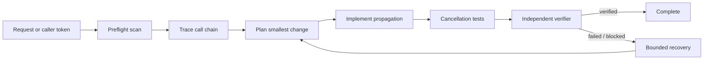

# Agent Streaming Response Cancellation Gate

Reusable guardrail for AI-assisted changes to long-lived .NET streaming paths. It detects and verifies cancellation propagation so disconnected callers do not leave database enumeration, HTTP requests, channels, delays, or response writes consuming resources.

## When to use
Use for SSE, streaming APIs, `IAsyncEnumerable<T>`, streamed exports, proxies, long polling, channel-backed responses, and similar paths. Do not use it as a substitute for general timeout, retry, or load-shedding design.

## Architecture



## Package tree

```text
agent-streaming-response-cancellation-gate/
├── README.md
├── config/policy.json
├── hooks/final-verification.md
├── hooks/preflight.md
├── rules/streaming-safety.md
├── scripts/scan-streaming-cancellation.py
├── skills/investigate-streaming-cancellation.md
├── subagents/cancellation-verifier.md
└── workflows/cancellation-gate.md
```

## Installation and dependencies
Copy the directory into the agent instructions/tooling area of a repository. The deterministic scanner requires Python 3.8+ and uses only the standard library. The target .NET repository supplies its own SDK and test framework.

## Configuration
`config/policy.json` documents the default cancellation expectations and approval boundaries. `max_disconnect_grace_ms` and `max_drain_ms` are policy targets, not runtime configuration changes. Adapt them to measured service behavior without silently modifying production settings.

## Permissions
Default to repository read/write plus local build/test execution. Production access is not required. Production configuration, breaking public contracts, infrastructure, destructive data actions, secrets, and weakened security controls require explicit human approval.

## Usage
From this package directory, run:

```bash
python scripts/scan-streaming-cancellation.py /path/to/repository --json
```

Then execute `workflows/cancellation-gate.md`. The scanner returns 0 for no findings, 1 for findings, and 2 for invalid execution/configuration. Findings are heuristics and must be confirmed against the call chain.

## Workflow
Preflight records workspace state and baseline scanner evidence. Investigation identifies the source token and traces every streaming boundary. Implementation makes the smallest propagation change. Tests cover normal completion and cancellation at relevant phases. The independent verifier, which cannot edit implementation code, decides whether evidence supports `verified`.

## Failure and recovery
Implementation/test repair is bounded to two total retries. Preserve scanner output, failing commands, stack traces, and diffs between attempts. A dependency with no cancellation support is not silently wrapped in unsafe retry logic; document containment and residual risk. Tool or permission failures stop verification when non-transient.

## Approval boundaries
Stop before breaking public API changes, production timeout/configuration changes, infrastructure changes, destructive data/file actions, secret changes, or security weakening. Approval applies only to the described action and does not authorize unrelated changes.

## Verification
A task is executed when edits/tests have been attempted. It is verified successfully only when the scanner is clean or findings are justified, target build/tests pass, cancellation is not converted into success, diff checks pass, changed-file scope is expected, and `subagents/cancellation-verifier.md` returns `status: verified`.

## Definition of Done
The source token is identified; affected call chain is traced; intended partial-output semantics are documented; required propagation changes exist; normal and cancellation tests pass; no unexplained scanner finding remains; no unrelated change exists; required approvals are present; independent verification succeeds; residual risk is recorded.

## Portability
The procedure is tool-neutral and can be used with coding agents that can inspect repositories and run local commands. The scanner is .NET/C# focused; replace it with a language-specific deterministic adapter while preserving the workflow, rules, retry budget, approval boundaries, and verifier separation.
