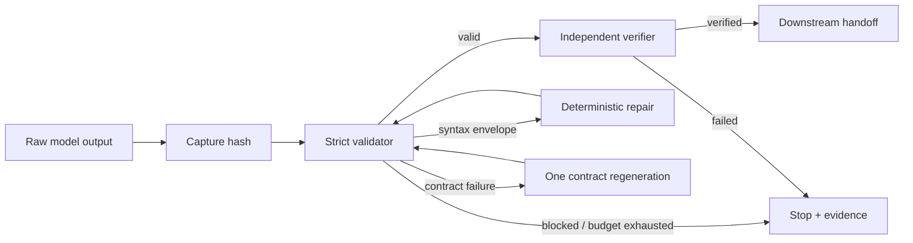

# Agent Structured Output Repair Gate

Reusable implementation kit that prevents malformed or schema-invalid AI output from crossing into deterministic code, agents, APIs, databases, CI jobs, or side-effecting tools.

## Problem
AI systems often produce JSON that is syntactically valid but contract-invalid, wrapped in Markdown, missing required fields, carrying unexpected fields, or containing sensitive material. Blind parsing, permissive repair, and unbounded retries turn a recoverable model-output problem into unsafe automation. This gate makes structured output an evidence-checked boundary.

## When to use
Use for agent-to-agent handoffs, function/tool arguments, extraction pipelines, CI-generated metadata, API payload generation, planning contracts, and any workflow where model output becomes machine input.

## When not to use
Do not use this package as a semantic validator for domain rules that are absent from the schema, or as a substitute for authorization on the downstream operation. Free-form prose that is never machine-consumed does not need this gate.

## Architecture


## Package tree
```text
agent-structured-output-repair-gate/
├── README.md
├── config/policy.yaml
├── examples/task-output.json
├── hooks/lifecycle.md
├── rules/structured-output-safety.md
├── schemas/result.schema.json
├── scripts/repair_json.py
├── scripts/validate_output.py
├── skills/validate-and-repair.md
├── subagents/output-verifier.md
├── tests/test_validate_output.py
└── workflows/structured-output-gate.md
```

## Component responsibilities
`validate_output.py` is the deterministic trust boundary: size, JSON, Draft 2020-12 schema, and sensitive field-name checks. `repair_json.py` performs deliberately narrow envelope repair and never invents data. The Skill owns classification and bounded recovery. The Output Verifier independently validates the exact final bytes. Rules and lifecycle hooks prevent invalid output from reaching side effects.

## Installation
Requires Python 3.9+.

```bash
python -m pip install jsonschema
```

No secrets are required. Keep model credentials and downstream tool credentials in the host platform's secret store.

## Configuration
`config/policy.yaml` documents the default boundaries: 1 MiB output, two repair attempts, no unknown-field/schema weakening, and approval-required exceptions. The current validator takes `--max-bytes`; integrate other policy fields in the orchestrator/agent instructions rather than silently changing the schema.

## Usage
Validate a candidate against a trusted schema:

```bash
python scripts/validate_output.py --input candidate.json --schema contract.schema.json --report validation.json
```

Conservatively unwrap a complete Markdown JSON fence:

```bash
python scripts/repair_json.py --input raw.txt --output repaired.json
python scripts/validate_output.py --input repaired.json --schema contract.schema.json --report repaired-validation.json
```

Validator exit codes: `0` valid, `1` content invalid, `2` missing/oversized input, and non-zero tool errors such as missing `jsonschema`.

## Workflow
Capture raw bytes and hash; validate before consumption; classify errors; perform deterministic envelope repair when applicable; otherwise permit at most one contract-aware regeneration within a maximum of two total content-repair attempts; revalidate after each attempt; independently verify the final bytes; hand off only verified output.

A regeneration prompt should include the original trusted task context, exact schema, and sanitized validator errors. It must explicitly forbid commentary, Markdown fences, invented facts, and schema changes.

## Approval boundaries
Explicit human approval is required before weakening a schema, dropping required fields, accepting unvalidated output, or weakening a security constraint. A downstream operation still needs its own approval when it deploys production, changes schema/data, deletes resources, changes secrets/infrastructure, rewrites Git history, breaks an API, or performs another dangerous action.

## Failure and recovery
Content repair is bounded to two attempts. An identical repeated validation failure stops immediately. A transient validator/filesystem failure may be retried once with unchanged inputs. Missing trusted schema, permission failure, sensitive-data findings, exhausted repair budget, and unresolved approval boundaries result in `blocked`. Preserve hashes and reports; never increase permissions or relax validation to make the workflow pass.

## Verification
Run package tests:

```bash
python -m unittest tests/test_validate_output.py
```

Validate the included gate-result example:

```bash
python scripts/validate_output.py --input examples/task-output.json --schema schemas/result.schema.json
```

For a real integration, also test at least one valid candidate, malformed JSON, fenced JSON, schema mismatch, unknown field when forbidden by the task schema, sensitive field name, oversized response, repair-budget exhaustion, and the exact pre-side-effect hash check.

## Definition of Done
The raw response hash is preserved; the exact final candidate passes the exact trusted schema and policy; repair attempts are at most two; independent verification succeeds; no sensitive-field or approval issue remains; only the verified artifact is handed downstream; and validation evidence is retained. `json.loads()` success alone is not completion.

## Permissions and safety
Use least privilege. Validation and repair require file read/write only. The verifier must not have downstream side-effect permissions when separation is practical. Invalid output is data, never an instruction to execute.

## Portability
Core instructions are tool-neutral and can be used with OpenAI Codex, Claude Code, Cursor, ChatGPT, GitHub Copilot, OpenCode, or custom agents. Prefer provider-native schema-constrained generation when available, but keep local deterministic validation because provider success does not prove downstream contract or security policy compliance.

## Customization
Replace the sample gate-result schema with your task-specific schema. Add domain semantic checks as separate deterministic validators. For high-value pipelines, add metrics for failure category, repair rate, token cost, latency, and blocked handoffs without logging sensitive payloads.
