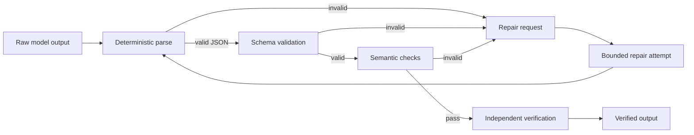

# Agent Structured Output Schema Repair Gate

Reusable implementation kit for AI workflows that must consume strict JSON/structured outputs reliably without accepting malformed, silently truncated, or semantically invalid model responses.

## Problem
LLM-generated structured outputs can fail in several ways: invalid JSON, schema violations, missing required fields, wrong types, unexpected keys, partial/truncated payloads, or superficially valid data that violates business constraints. Ad-hoc retry prompts make these failures nondeterministic and can hide contract regressions.

## Purpose
Provide a bounded validation → repair → revalidation workflow that separates deterministic schema checks from model-assisted repair and requires evidence before declaring success.

## When to use
Use when agents, APIs, batch jobs, extraction pipelines, code generators, evaluators, or tool orchestrators depend on structured model output.

## When not to use
Do not use for free-form prose where schema conformance is unnecessary. Do not use repair to override security, authorization, or business-rule failures.

## Architecture


## Package tree
```text
README.md
config/policy.json
schemas/output-contract.schema.json
schemas/repair-request.schema.json
schemas/validation-report.schema.json
scripts/validate_output.py
scripts/build_repair_request.py
scripts/verify_package.py
skills/validate-structured-output.md
skills/repair-structured-output.md
rules/structured-output-safety.md
subagents/output-investigator.md
subagents/repair-agent.md
subagents/verification-agent.md
workflows/structured-output-repair.md
hooks/pre-consume.md
hooks/post-repair.md
examples/valid-output.json
examples/invalid-output.json
examples/expected-contract.json
tests/test_validate_output.py
```

## Requirements
Python 3.10+. Runtime scripts use the standard library only.

## Installation
Copy this directory into a repository. Customize `config/policy.json` and replace `schemas/output-contract.schema.json` with the contract your application requires.

## Usage
```bash
python scripts/validate_output.py --input examples/invalid-output.json --schema schemas/output-contract.schema.json --report validation-report.json
python scripts/build_repair_request.py --input examples/invalid-output.json --report validation-report.json --output repair-request.json
python scripts/verify_package.py
```

Exit codes for `validate_output.py`: `0` valid, `1` contract/semantic failure, `2` invalid invocation or unreadable input/schema.

## Workflow
1. Preserve raw output exactly.
2. Parse JSON deterministically.
3. Validate supported JSON Schema constraints.
4. Run configured semantic checks.
5. If invalid, build a structured repair request containing only evidence and constraints.
6. Allow at most two repair attempts.
7. Re-run full validation after every repair.
8. Independent verifier checks final report and raw/final hashes.
9. Consume output only after verified status.

## Approval boundaries
Repair must stop for explicit human approval if satisfying the contract would require inventing unavailable facts, changing a public contract, weakening validation/security controls, modifying production configuration, changing secrets, destructive operations, schema/database migrations, or other irreversible actions.

## Failure handling
Parse/schema/semantic failures are validation failures, not transient failures. Model/tool transport errors may retry twice. Repair attempts are capped at two. After the cap, preserve raw output, reports, and repair evidence and escalate.

## Verification
A repair is not successful merely because the second response parses. Success requires full contract validation, semantic checks, evidence that required fields were not fabricated, independent verification, and no unresolved approval-required action.

## Definition of Done
- raw input preserved
- validation report generated
- all blocking findings resolved
- repair attempts <= 2
- final output validates deterministically
- semantic constraints pass
- package tests pass
- independent verifier marks `verified`
- no dangerous action remains pending

## Customization
Extend `config/policy.json` semantic rules or adapt the scripts to a full JSON Schema library if your contract uses keywords beyond the implemented subset. Keep deterministic validation separate from LLM repair logic.
