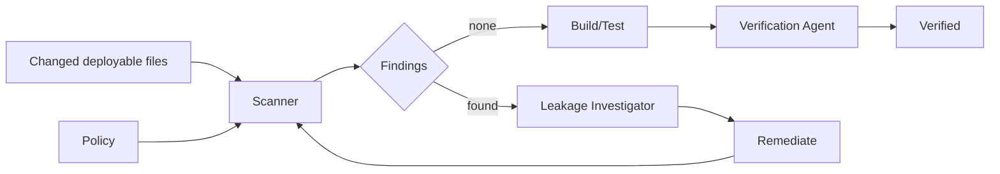

# Agent Test-Double Leakage Gate

A reusable AI engineering package that detects and blocks test doubles, mock endpoints, fake credentials, stub transports, and test-only dependency wiring from leaking into production code or deployable configuration.

## Problem

AI-assisted changes often reuse nearby test code while implementing production behavior. That can silently introduce `Mock*`, `Fake*`, `Stub*`, localhost test endpoints, test-only DI registrations, fixture credentials, or test environment switches into deployable paths. Builds and unit tests may still pass while production behavior becomes incorrect or unsafe.

This package adds a deterministic repository gate plus a structured agent workflow for investigation, remediation, and independent verification.

## When to use

Run when production code/configuration, integration wiring, DI, external clients, storage, auth, queues, feature flags, test doubles, or file placement changes.

## Architecture



## Package tree

```text
agent-test-double-leakage-gate/
├── README.md
├── config/leakage-policy.json
├── hooks/final-verification.md
├── hooks/pre-merge-scan.md
├── rules/test-double-boundaries.md
├── schemas/leakage-report.schema.json
├── scripts/scan_test_double_leakage.py
├── scripts/verify_package.py
├── skills/detect-test-double-leakage.md
├── skills/remediate-test-double-leakage.md
├── subagents/leakage-investigator.md
├── subagents/verification-agent.md
├── tests/test_scan_test_double_leakage.py
└── workflows/leakage-prevention.md
```

## Requirements

Python 3.10+, standard library only. The scanner is read-only and non-destructive.

## Usage

```bash
python scripts/scan_test_double_leakage.py --root . --policy config/leakage-policy.json --output leakage-report.json
```

Changed files:

```bash
git diff --name-only --diff-filter=ACMR origin/main...HEAD > changed-files.txt
python scripts/scan_test_double_leakage.py --root . --policy config/leakage-policy.json --changed-files changed-files.txt --output leakage-report.json
```

Exit codes: `0` clean, `2` blocking findings, `4` invalid input/policy, `5` internal error.

## Policy

`config/leakage-policy.json` defines production/test globs, filename rules, content rules, explicit narrow exceptions, text extensions, and maximum file size. Do not broaden exclusions merely to pass the gate.

## Workflow

Context → deterministic scan → classify → remediate → rescan → build/tests → independent verification. Remediation is bounded to two cycles.

## Approval boundaries

Human approval is required before remediation changes production credentials/secrets, infrastructure, database schema, deployment configuration, public API contracts, external production endpoints, or security controls. High-severity scanner exceptions require repository-owner review.

## Failure handling

Invalid policy gets one correction retry. Transient scanner/tool failure gets at most two retries if no mutation occurred. Confirmed leakage gets at most two remediation cycles. Permission failures, unknown production source of truth, ambiguous dynamic resolution, or missing approval are blocking.

## Verification

```bash
python scripts/verify_package.py
```

The self-check validates required files, parses JSON assets, runs unit tests, and exercises clean/leaking synthetic repositories.

## Definition of Done

All in-scope deployable paths were scanned; no unexcepted blocking finding remains; production wiring resolves to production-capable implementations/endpoints; test doubles remain test-scoped; relevant build/tests pass; independent verification succeeds; required approvals/exceptions are documented; no blocking ambiguity remains.