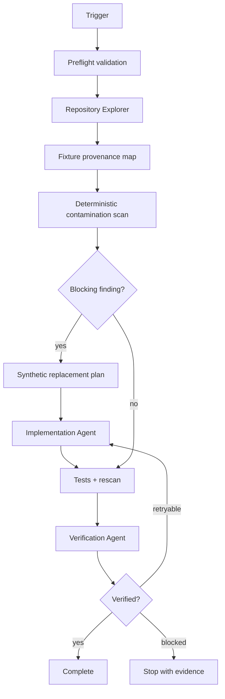

# Agent Test Fixture Production Data Contamination Gate

Prevent real production data, credentials, production endpoints, and sensitive identifiers from entering test fixtures, snapshots, seeds, mocks, or recorded HTTP cassettes.

## Problem

AI-assisted debugging often starts from real logs, database rows, API payloads, screenshots, HAR files, or incident exports. A coding agent may copy those values into tests because they reproduce the bug quickly. That can permanently commit secrets, personal data, production hostnames, tenant identifiers, access tokens, or customer payloads to source control. Traditional secret scanners catch only some cases and cannot distinguish a safe synthetic fixture from a production-derived one.

This kit combines deterministic scanning, explicit provenance, bounded agent investigation, synthetic replacement, and independent verification.

## Trigger

Use when creating or modifying test fixtures, snapshots, golden files, seed data, mock responses, VCR/cassette recordings, HAR files, SQL test data, test databases, or bug reproductions derived from operational evidence.

## Inputs

- repository root;
- optional changed-file list;
- optional incident/log/API evidence used to reproduce the bug;
- `config/fixture-contamination.json`;
- repository-specific test/build commands.

## Architecture



## Package tree

```text
agent-test-fixture-production-data-contamination-gate/
├── README.md
├── config/
│   └── fixture-contamination.json
├── examples/
│   └── evidence.example.json
├── hooks/
│   ├── post-edit-gate.md
│   └── pre-task-validation.md
├── rules/
│   └── fixture-safety.md
├── schemas/
│   └── evidence.schema.json
├── scripts/
│   ├── run-gate.sh
│   ├── scan-fixtures.py
│   ├── validate-config.py
│   └── verify-evidence.py
├── skills/
│   ├── contamination-investigation.md
│   ├── synthetic-fixture-replacement.md
│   └── verification.md
├── subagents/
│   ├── implementation-agent.md
│   ├── repository-explorer.md
│   └── verification-agent.md
├── tests/
│   └── test-scan-fixtures.py
└── workflows/
    └── end-to-end.md
```

## Dependencies

Python 3.10+ using only the standard library. `run-gate.sh` requires a POSIX shell. No network access is required.

## Installation

Copy this directory into a repository. Adjust `config/fixture-contamination.json` to match fixture roots and allowed synthetic domains.

Validate the package:

```bash
python3 scripts/validate-config.py --config config/fixture-contamination.json
python3 -m unittest tests/test-scan-fixtures.py
```

## Configuration

The config defines fixture path patterns, ignored directories, production-domain deny patterns, accepted synthetic domains, sensitive-key names, high-entropy token thresholds, and whether real-looking email/IP/account identifiers block the gate.

Safe defaults block on explicit production domains, credential-like keys with values, private-key material, bearer/token formats, and high-confidence production identifiers. Lower-confidence PII-like patterns are reported for review rather than automatically treated as confirmed production data.

## Usage

```bash
./scripts/run-gate.sh \
  --repo /path/to/repo \
  --output /tmp/fixture-scan.json
```

Direct scan:

```bash
python3 scripts/scan-fixtures.py \
  --repo /path/to/repo \
  --config config/fixture-contamination.json \
  --output /tmp/fixture-scan.json
```

Validate final evidence:

```bash
python3 scripts/verify-evidence.py \
  --evidence /tmp/fixture-evidence.json \
  --schema schemas/evidence.schema.json
```

## Workflow

1. Validate repository and configuration.
2. Discover fixture/snapshot/seed/cassette locations and nearby tests.
3. Record fixture provenance: synthetic, generated, unknown, or production-derived.
4. Scan candidate files deterministically.
5. Confirm findings against repository evidence; do not label heuristic PII matches as confirmed without evidence.
6. Replace unsafe values with synthetic equivalents while preserving bug-relevant shape and constraints.
7. Add regression tests that prove behavior without depending on sensitive values.
8. Run repository tests, build/static checks when applicable, then rescan.
9. Produce evidence JSON.
10. Independent Verification Agent checks the diff and evidence.

Maximum implementation retries: **2**.

## Approval boundaries

Explicit human approval is required before:

- accessing production databases, production logs, customer exports, or secret stores;
- copying additional production data into the working tree even temporarily;
- modifying production configuration;
- deleting production or customer data;
- weakening security or privacy controls;
- committing previously exposed secrets instead of rotating/removing them;
- changing public API contracts or database schemas;
- force push/history rewriting.

The agent must stop before approval-required actions. Existing evidence supplied for the task may be inspected using least privilege, but must not be persisted into fixtures.

## Failure and recovery

- **Validation failure:** stop; preserve stderr and config path.
- **Blocking scan finding:** do not commit; investigate and synthesize replacement.
- **Build/test failure:** diagnose once and retry implementation at most twice total.
- **Tool failure:** retry once only if transient; otherwise stop with evidence.
- **Permission failure:** never increase permissions automatically.
- **Unknown provenance:** treat as unresolved risk; verification cannot be `verified` until resolved or explicitly accepted by a human.
- **Suspected live secret:** remove from the working tree and flag for human-led rotation; do not test whether it is valid.

## Verification

`task_executed` means the scan/remediation workflow ran. `verified` requires all applicable checks below:

- configuration validation passes;
- affected fixtures have recorded provenance;
- no blocking contamination finding remains;
- repository tests covering changed behavior pass;
- no unintended fixture changes exist;
- evidence JSON is structurally valid;
- independent verifier confirms synthetic replacements preserve the relevant data shape;
- approval-required actions are either absent or approved outside the agent loop.

## Definition of Done

- All affected fixture paths were inspected.
- Production-derived values are removed or isolated outside version control.
- Synthetic replacements preserve only behaviorally necessary structure.
- Tests reproduce the target behavior using synthetic data.
- Deterministic scan has zero unresolved blocking findings.
- Evidence and independent verification are complete.
- Remaining uncertainty is documented.
- No secret, customer record, or production payload was newly committed.

## Customization

Add organization-specific production domains and sensitive key names in config. Prefer stable synthetic domains such as `example.com`, `.test`, `.invalid`, RFC documentation IP ranges, and deterministic fake identifiers. Do not add a broad allowlist merely to silence findings; allowlist only values whose synthetic provenance is known.
