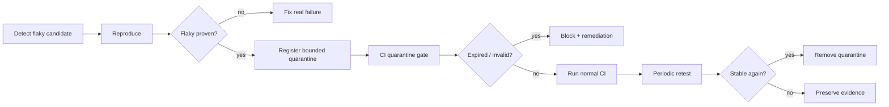

# Agent Test Flakiness Quarantine Expiry Gate

A reusable engineering kit for controlling flaky-test quarantine so temporary skips do not become permanent blind spots.

## Problem

Teams often quarantine nondeterministic tests to unblock CI, but quarantines accumulate, ownership decays, and disabled coverage silently becomes permanent. AI coding agents can worsen this by adding skips as a tactical fix without proving flakiness, assigning ownership, or restoring coverage.

This package makes quarantine explicit, time-bounded, attributable, evidence-backed, and automatically verifiable.

## Trigger

Use when a test is proposed for skip/quarantine, when an existing quarantine expires, before release, after CI flakiness incidents, or whenever an agent modifies test-selection logic.

## Inputs

- repository root
- `config/quarantine-policy.json`
- `quarantine.json` registry in the consuming repository
- test identifiers and owner
- evidence showing repeated pass/fail nondeterminism
- host test command

## Architecture



## Package tree

```text
README.md
config/quarantine-policy.json
schemas/quarantine.schema.json
schemas/gate-report.schema.json
scripts/quarantine_gate.py
scripts/verify_package.py
skills/prove-flakiness.md
skills/quarantine-remediation.md
rules/test-quarantine-safety.md
subagents/flakiness-investigator.md
subagents/remediation-planner.md
subagents/verification-agent.md
workflows/quarantine-lifecycle.md
hooks/pre-quarantine.md
hooks/pre-merge.md
examples/quarantine.json
examples/flaky-runs.json
tests/test_quarantine_gate.py
```

## Requirements

Python 3.10+. Runtime scripts use only the standard library.

## Installation

Copy this directory into a repository. Copy `examples/quarantine.json` to the repository root as `quarantine.json`, then adapt owners, tests, and dates.

## Configuration

`config/quarantine-policy.json` defines maximum quarantine lifetime, evidence requirements, and allowed statuses. The default maximum lifetime is 14 days.

## Usage

```bash
python scripts/quarantine_gate.py \
  --registry quarantine.json \
  --policy config/quarantine-policy.json \
  --report quarantine-report.json

python scripts/verify_package.py
```

Exit codes:

- `0`: registry is valid and no quarantine blocks
- `1`: expired/invalid quarantine or policy violation
- `2`: invalid input/configuration

## Quarantine contract

Each entry must include a unique test id, owner, reason, evidence reference, creation timestamp, expiry timestamp, and status. Active quarantines must not exceed policy lifetime. Expired entries block until removed, renewed with fresh evidence and approval, or converted into a tracked defect workflow.

## Approval boundaries

Explicit human approval is required to extend an expired quarantine, disable additional tests, weaken coverage thresholds, change production configuration, deploy production, alter secrets/infrastructure, perform destructive data operations, rewrite Git history, or weaken security controls.

## Failure and recovery

- Invalid registry/policy: stop; do not fail open.
- Missing evidence: quarantine request is rejected.
- Transient CI/tool failure: retry at most twice while preserving logs.
- Reproduction uncertainty: do not classify as flaky.
- Expired quarantine: block merge until remediation or approved bounded renewal.
- Failed remediation: at most two fix/retest cycles before escalation.

## Verification

A task is verified only when deterministic registry validation passes, relevant tests/build pass, quarantine changes match evidence, no unintended skips were introduced, and the independent Verification Agent confirms the lifecycle state.

## Definition of Done

- flakiness was reproduced or rejected with evidence
- every active quarantine has owner, reason, evidence, created/expiry dates
- no active quarantine exceeds policy lifetime
- expired entries are removed or explicitly renewed with approval
- host tests/build pass as required
- package tests pass
- independent verification completes
- residual risk is documented

## Portability

Core behavior is tool-neutral and works with Codex, Claude Code, Cursor, ChatGPT, GitHub Copilot, OpenCode, and CI systems that can invoke Python.
