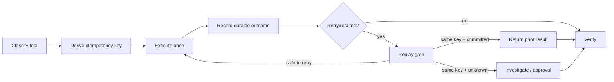

# Agent Tool-Call Idempotency Replay Gate

A reusable implementation kit that prevents AI agents from repeating side-effecting tool actions when retries, timeouts, resumptions, or duplicated messages occur.

## Problem
Agent runtimes commonly retry after timeouts without knowing whether the previous tool call committed. For payments, tickets, emails, provisioning, mutations, or external API writes, blind retries can create duplicate irreversible side effects.

## Trigger
Use whenever an agent invokes a mutating tool and execution can be retried, resumed, redelivered, or recovered after an ambiguous failure.

## Inputs
- tool-call execution trace in JSONL
- tool classification policy in `config/policy.json`
- idempotency key for each mutating operation
- request fingerprint for semantic identity
- completion/commit evidence when available
- optional explicit human approval for unsafe replay

## Architecture


## Package tree
```text
README.md
config/policy.json
schemas/trace-event.schema.json
schemas/report.schema.json
scripts/idempotency_gate.py
scripts/verify_package.py
skills/classify-tool-risk.md
skills/investigate-ambiguous-outcome.md
rules/idempotency-safety.md
subagents/execution-planner.md
subagents/replay-verifier.md
workflows/idempotent-tool-execution.md
hooks/pre-tool-call.md
hooks/post-tool-call.md
templates/tool-call-envelope.json
examples/trace-safe.jsonl
examples/trace-duplicate.jsonl
tests/test_idempotency_gate.py
```

## Requirements
Python 3.10+. The deterministic scripts use only the standard library.

## Trace model
Each JSONL event records `event_id`, `timestamp`, `tool`, `operation`, `idempotency_key`, `request_fingerprint`, `status`, and `side_effecting`. Status is one of `started`, `committed`, `failed`, `unknown`, or `returned_cached`.

The gate blocks when the same idempotency key is associated with different request fingerprints, when a side-effecting operation is committed more than once, or when a retry occurs after an ambiguous `unknown` outcome without a durable prior-result resolution.

## Usage
```bash
python scripts/idempotency_gate.py --trace examples/trace-safe.jsonl --policy config/policy.json --output report.json
python scripts/idempotency_gate.py --trace examples/trace-duplicate.jsonl --policy config/policy.json --output report.json
python scripts/verify_package.py
```

Exit codes: `0` verified safe, `1` replay/idempotency violation, `2` invalid input or configuration.

## Permissions and approval
Default behavior is non-destructive and evidence-first. Explicit human approval is required before replaying an operation whose previous result is ambiguous and whose tool is classified `high` or `critical`, and separately before production deployment, destructive data/file operations, schema/infrastructure/secret changes, force push/history rewrite, breaking API changes, security weakening, or irreversible migrations.

## Failure and recovery
Transient read/tool errors may retry twice. Validation errors do not retry blindly. Ambiguous mutating outcomes preserve evidence and stop. Fix/test cycles are capped at two. Permission failures stop immediately. The workflow never converts `unknown` to `failed` merely to permit replay.

## Verification
Task execution is distinct from successful verification. Verification requires a valid trace, zero blocking findings, stable request fingerprints per idempotency key, at most one committed side effect per key, host tests/build passing, and independent verifier review.

## Definition of Done
- mutating tools are classified
- every side-effecting call has a stable idempotency key and fingerprint
- trace evidence is durable and valid
- no duplicate committed side effect exists
- ambiguous outcomes are resolved or explicitly approved under policy
- deterministic gate and tests pass
- independent verification completes
- residual risks are recorded
- no blocking approval remains

## Portability
The workflow is agent-neutral. OpenAI Codex, Claude Code, Cursor, ChatGPT, GitHub Copilot, OpenCode, and custom runtimes can use the same envelope and gate. Tool-specific storage/adapters stay outside the core contract.