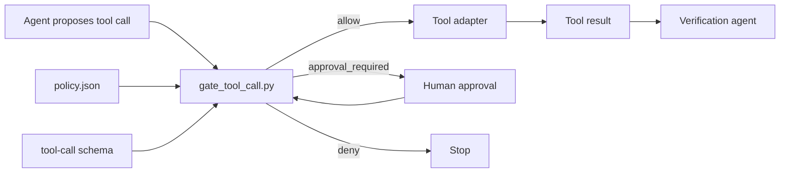

# Agent Tool Call Safety Gate

A reusable pre-execution policy gate for AI coding agents. It validates proposed tool calls, applies deterministic allow/deny/approval rules, produces auditable decisions, and blocks dangerous operations before a tool is invoked.

## Problem

Coding agents increasingly invoke shell, filesystem, Git, database, deployment, and infrastructure tools. Free-form prompting alone is not a reliable control boundary: a model can misunderstand scope, compose a dangerous command, or act after context has changed.

This package moves the final authorization decision into deterministic code.

## When to use

Use it when an agent can invoke tools that read or mutate repositories, execute commands, change Git state, access databases, deploy software, or modify infrastructure.

Do not use it as a substitute for OS/container isolation, production IAM, database permissions, secret management, or human review for irreversible operations.

## Architecture



The gate is intentionally tool-neutral. Adapters only need to serialize a proposed call to the request contract and honor the gate exit code.

## Package tree

```text
agent-tool-call-safety-gate/
├── README.md
├── config/
│   └── policy.json
├── examples/
│   ├── approval.json
│   ├── destructive-shell.json
│   └── safe-read.json
├── hooks/
│   ├── post-tool-call.md
│   └── pre-tool-call.md
├── rules/
│   └── tool-call-safety.md
├── schemas/
│   ├── gate-decision.schema.json
│   └── tool-call.schema.json
├── scripts/
│   ├── gate_tool_call.py
│   └── verify_package.py
├── skills/
│   ├── evaluate-tool-call.md
│   └── review-policy-exception.md
├── subagents/
│   ├── policy-evaluator.md
│   └── verification-agent.md
├── tests/
│   └── test_gate_tool_call.py
└── workflows/
    └── tool-call-gating.md
```

## Requirements

- Python 3.10+
- No third-party Python packages
- A tool adapter capable of stopping execution when the gate returns a non-zero exit code

## Input contract

A tool call is JSON with `request_id`, `tool`, `operation`, `arguments`, and `requested_by`. Optional `context` can include repository/environment metadata. See `schemas/tool-call.schema.json`.

## Policy

`config/policy.json` contains ordered rules. Highest `priority` wins; ties keep file order. Each rule matches a tool glob, operation glob, and optional regular expressions over dotted argument paths.

Effects:

- `allow`: execution may proceed.
- `deny`: execution must stop.
- `approval`: execution stops unless a matching, unexpired approval record is supplied.

Default action is `deny`.

## Usage

Evaluate a safe repository read:

```bash
python scripts/gate_tool_call.py \
  --request examples/safe-read.json \
  --policy config/policy.json
```

Evaluate a destructive shell request:

```bash
python scripts/gate_tool_call.py \
  --request examples/destructive-shell.json \
  --policy config/policy.json
```

Evaluate the same request with an approval record:

```bash
python scripts/gate_tool_call.py \
  --request examples/destructive-shell.json \
  --policy config/policy.json \
  --approval examples/approval.json
```

An approval never overrides a `deny` rule. It only satisfies a matched `approval` rule.

## Exit codes

| Code | Meaning |
|---:|---|
| 0 | Allowed |
| 2 | Denied by policy |
| 3 | Human approval required |
| 4 | Invalid request, policy, or approval input |
| 5 | Internal evaluation error |

The decision JSON is always written to stdout on handled outcomes. Use `--output <path>` to persist it as well.

## Integration

1. Serialize the proposed tool call before invocation.
2. Run the pre-tool hook described in `hooks/pre-tool-call.md`.
3. Invoke the real tool only on exit code `0` and decision status `allow`.
4. Preserve the decision with execution evidence.
5. Run normal tests/build/security verification after mutations.

Never make the model itself responsible for interpreting a denial and overriding it.

## Approval boundaries

Human approval is required for shell execution, repository writes, Git mutation, database mutation, deployment, infrastructure mutation, production configuration changes, and secret changes unless a higher-priority rule explicitly denies them.

The supplied policy permanently denies representative irreversible/high-risk command patterns such as force-push, `git reset --hard`, destructive root deletion, database destruction, and namespace deletion. Customize these patterns for your environment, but weakening them requires policy-owner review.

## Failure and recovery

- Invalid JSON/schema shape: stop with exit code `4`; fix the producer or policy.
- No matching rule: default deny; add an explicit reviewed rule if the operation is legitimate.
- Approval missing/expired/mismatched: stop with exit code `3`; obtain a fresh approval bound to the exact request and rule.
- Tool failure after an allowed call: do not re-run blindly. Preserve decision/tool evidence and apply the owning workflow's bounded retry policy.
- Gate internal error: stop with exit code `5`; never fail open.

## Verification

Run:

```bash
python scripts/verify_package.py
```

This checks required files, parses JSON assets, runs the unit tests, and executes the safe/approval examples.

## Definition of Done

A tool call is verified for execution only when:

1. Request shape is valid.
2. Policy parses and has a supported version.
3. A deterministic rule or default action produces a decision.
4. `deny` decisions never execute.
5. `approval` decisions execute only with a valid approval bound to the request and matched rule.
6. The adapter records the decision with the eventual tool result.
7. Repository/build/test verification required by the parent task still passes after any mutation.

`Task executed` and `task verified successfully` remain separate states.

## Customization

Add narrow, high-priority rules rather than broad allows. Prefer read-only tool operations to shell command allowlists. Keep production and destructive actions approval-gated or denied. Add tests for every policy exception.