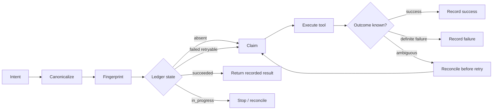

# Agent Tool Idempotency Gate

A reusable safety kit that prevents AI agents from accidentally executing the same side-effecting tool action more than once after retries, timeouts, resumptions, or ambiguous responses.

## Problem
Agent workflows commonly retry API calls after transport failures. If the first call succeeded but its response was lost, a blind retry can create duplicate tickets, payments, messages, deployments, records, or commits.

## Use when
Use this package around side-effecting API/MCP/tool calls whose outcome can be ambiguous. Do not use it as a substitute for a provider's native idempotency mechanism; prefer provider idempotency keys when available and use this gate as orchestration protection.

## Architecture

## Package tree
- `skills/design-idempotent-tool-call.md`
- `skills/reconcile-ambiguous-outcome.md`
- `rules/idempotency-rules.md`
- `subagents/execution-agent.md`
- `subagents/verification-agent.md`
- `workflows/idempotent-tool-execution.md`
- `hooks/pre-tool-call.md`
- `hooks/post-tool-call.md`
- `scripts/idempotency_gate.py`
- `scripts/verify_ledger.py`
- `config/idempotency.yaml`
- `schemas/tool-intent.schema.json`
- `templates/tool-intent.json`
- `examples/create-ticket.json`
- `tests/test_idempotency_gate.py`

## Requirements
Python 3.10+ and only the standard library. The reference ledger uses SQLite and is safe for local single-host workflows. For distributed agents, replace the ledger adapter with a transactional shared store while preserving the state contract.

## Configuration
Copy `config/idempotency.yaml` and choose a ledger path. The executable script itself uses `IDEMPOTENCY_DB` when set, otherwise `.agent/idempotency.sqlite3`. Never put secrets in intent payloads; store stable secret references instead.

## Usage
Before a side effect, validate and claim an intent:

`python scripts/idempotency_gate.py claim --intent tool-intent.json`

Exit code 0 with status `claimed` means execution may proceed. `already_succeeded` means do not execute; reuse the recorded result. `in_progress` or `ambiguous` blocks execution until reconciliation.

After a confirmed success:

`python scripts/idempotency_gate.py complete --key <key> --result-ref <non-secret-reference>`

After a definite retryable failure:

`python scripts/idempotency_gate.py fail --key <key> --retryable --error "HTTP 503"`

After a timeout or lost response:

`python scripts/idempotency_gate.py ambiguous --key <key> --error "timeout after send"`

Inspect state with `python scripts/idempotency_gate.py status --key <key>` and validate the ledger with `python scripts/verify_ledger.py`.

## Workflow
The Execution Agent may execute only after a successful claim. Ambiguous outcomes are handed to the Verification Agent, which must use provider read APIs, audit logs, correlation IDs, or deterministic resource lookup. At most two execution retries are allowed, and no retry is allowed while state is `ambiguous`.

## Approval boundaries
Human approval is required before production deployment, destructive operations, schema changes, secret/configuration changes, breaking API changes, infrastructure mutation, force push/history rewrite, or any operation whose duplicate effect cannot be reliably reconciled. Approval does not waive idempotency checks.

## Failure handling
Transient definite failures may be retried up to two times. Ambiguous failures are never blindly retried. Permission and validation failures are non-retryable. Evidence from every attempt must be retained in the ledger or external audit system.

## Verification
Run `python -m unittest tests/test_idempotency_gate.py` and `python scripts/verify_ledger.py`. Verification must prove duplicate claims cannot re-execute a completed intent, ambiguous states block claims, retry limits are enforced, and payload drift for the same key is rejected.

## Definition of Done
An operation is complete only when its intent is canonicalized, a stable fingerprint exists, the ledger has a terminal `succeeded` record, the result reference is recorded, duplicate execution is blocked, tests pass, and any required human approval is documented externally.

## Portability
The Markdown workflow is tool-neutral. The Python implementation can wrap MCP clients, REST SDKs, CLI commands, Codex, Claude Code, Cursor, ChatGPT, Copilot, or custom agents. Replace only the execution adapter and ledger backend when necessary; preserve state semantics and verification rules.
