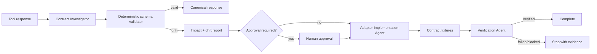

# Agent Tool Output Schema Drift Gate

Reusable guardrail for AI agents that depend on structured tool/API responses. It detects contract drift before missing fields, new statuses, or changed types can silently alter agent control flow or trigger unsafe actions.

## Problem
Tool providers evolve. A response that used to contain a required identifier, status, or object may become optional, renamed, differently typed, or extended with a new control state. Loose parsers can turn this into false success, bad retries, or writes made with incorrect assumptions.

## Purpose
Fail closed on ambiguous/breaking drift, isolate provider changes in adapters, retain evidence, and independently verify any compatibility fix.

## When to use
Use after tool/API upgrades, unexplained parser failures, before autonomous use of a new tool, or when response contracts are not strongly versioned. Do not use this package as a substitute for business-domain validation or provider authentication.

## Architecture


## Package tree
```text
agent-tool-output-schema-drift-gate/
├── README.md
├── hooks/
│   ├── final-verification.md
│   ├── post-edit.md
│   └── pre-task.md
├── rules/
│   └── safety-and-contract-rules.md
├── schemas/
│   └── tool-output-contract.schema.json
├── scripts/
│   ├── inspect-changes.py
│   ├── preflight.py
│   ├── run-contract-tests.py
│   └── validate-tool-output.py
├── skills/
│   ├── adapt-contract-safely.md
│   └── detect-schema-drift.md
├── subagents/
│   ├── adapter-implementation-agent.md
│   ├── contract-investigator.md
│   └── verification-agent.md
├── templates/
│   └── drift-report.json
├── tests/
│   ├── cases.json
│   └── fixtures/
│       ├── known-good.json
│       ├── missing-status.json
│       ├── new-compatible.json
│       ├── unknown-status.json
│       └── wrong-type.json
└── workflows/
    └── schema-drift-gate.md
```

## Dependencies
Python 3.9+ and Git. The validator intentionally uses only the Python standard library so the gate can run in constrained agent environments.

## Installation
Copy this directory into a repository. Replace the example canonical schema and fixtures with the actual normalized tool contract while preserving fail-closed control fields and negative fixtures.

## Configuration
The default contract requires `status`, `request_id`, `data`, and `errors`. Keep provider-specific response handling outside the canonical workflow. No secrets or environment variables are required.

## Permissions
Investigation and verification need read-only repository access. The implementation agent needs write access only to the approved adapter/test scope. Production, secrets, infrastructure, permissions, destructive actions, validation weakening, and breaking contracts require explicit human approval.

## Usage
```bash
python scripts/preflight.py
python scripts/validate-tool-output.py --input tests/fixtures/known-good.json --schema schemas/tool-output-contract.schema.json
python scripts/run-contract-tests.py
python scripts/inspect-changes.py
```

## Workflow
Follow `workflows/schema-drift-gate.md`. The Contract Investigator owns evidence and impact analysis, the Adapter Implementation Agent owns the narrow compatibility change, and the Verification Agent independently proves completion.

## Retry and recovery
Only timeout, rate-limit, and temporary transport tool failures are retried, at most twice. Validation failures are not transient. Implementation/test correction is limited to two attempts. Repeated failure stops with redacted evidence; permissions are never silently increased.

## Approval boundaries
Stop before production deployment, destructive operations, schema/database mutation, secrets/config changes, permission expansion, breaking public contracts, irreversible migrations, or weakening validation/security controls.

## Verification
`run-contract-tests.py` proves positive and negative fixtures. `inspect-changes.py` exposes scope and runs `git diff --check`. Final verification must be performed independently and may report only `verified`, `failed`, or `blocked`.

## Definition of Done
- Current and retained compatible fixtures validate.
- Missing, wrongly typed, and unknown control fields fail closed.
- Provider drift is isolated to a boundary adapter.
- Contract tests pass after no more than two implementation attempts.
- Changed files are scoped and inspected.
- Required human approvals exist.
- Independent verification status is `verified`.
- Remaining risks and open questions are recorded.

## Customization
Extend the canonical schema with domain fields, add fixtures for every provider version you intentionally support, and add repository-specific build/test commands to the post-edit hook. Keep deterministic contract validation separate from LLM reasoning.