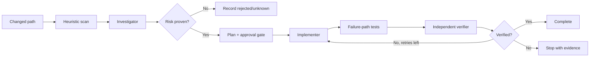

# Agent Transaction Boundary Side-Effect Gate

A reusable evidence-and-verification gate for code paths that combine database transactions with external side effects such as HTTP calls, messages, email, files, or blobs. It detects and proves atomicity gaps where database state and an external action can diverge, then guides bounded remediation and independent verification.

## Problem
A database rollback cannot undo an already-sent email, HTTP request, queue message, or file write. Conversely, committing database state before an unreliable external effect can lose the effect. Retries can duplicate it. These bugs often survive happy-path tests.

## When to use
Use during feature implementation, bug fixing, code review, incident RCA, or refactoring when persistence and external effects share a request/job flow.

Do not use it as proof that every scanner match is defective, or to justify production mutation. Pure read-only flows do not need this gate.

## Architecture


## Package tree
```text
agent-transaction-boundary-side-effect-gate/
├── README.md
├── config/gate.yaml
├── hooks/final-verification.md
├── hooks/pre-task.md
├── rules/safety.md
├── scripts/scan-side-effects.py
├── scripts/verify-report.py
├── skills/detect-transaction-side-effects.md
├── skills/remediate-atomicity-gap.md
├── subagents/implementer.md
├── subagents/investigator.md
├── subagents/verifier.md
├── templates/finding.json
└── workflows/transaction-side-effect-gate.md
```

## Installation and dependencies
Copy this directory into the target repository. Python 3 and Git are required for deterministic scanning/report validation. No Python packages are required. Build/test dependencies remain those of the target repository.

## Configuration
Edit `config/gate.yaml` only when repository-specific transaction/effect markers or approval policy differ. The scripts intentionally use conservative built-in markers and do not perform writes outside `.ai/`.

## Permissions
Core investigation needs repository read access and local Git/build/test execution. Editing requires normal working-tree write access. The kit never requires production credentials. Use least privilege.

## Usage
From the target repository:

```bash
python path/to/agent-transaction-boundary-side-effect-gate/scripts/scan-side-effects.py --base origin/main --output .ai/transaction-side-effects.json
```

Exit code 0 means no heuristic candidates, 1 means candidates require investigation, and 2 means tool/input failure. A zero does not prove global absence outside the scanned diff.

Then execute `workflows/transaction-side-effect-gate.md`. Findings may use `templates/finding.json` as the handoff contract.

## Component responsibilities
`skills/detect-transaction-side-effects.md` defines evidence collection and classification. `skills/remediate-atomicity-gap.md` defines safe remediation. The investigator cannot edit; the implementer cannot self-certify; the verifier independently reconstructs the risk. Hooks bind deterministic scanning and report validation to lifecycle checkpoints.

## Approval boundaries
Explicit human approval is required before database schema changes, destructive SQL, production writes/deployments, infrastructure/config/secret changes, breaking API changes, weakened security controls, or irreversible migrations. Agents stop at the boundary and never increase permissions silently.

## Failure and recovery
The workflow shares a maximum of two fix/test retries. Each retry preserves the failing command/output, prior hypothesis, and diff. Permission failures and missing approval are not retryable. Tool failures are never interpreted as clean results.

## Verification
Verification must show the original asymmetric failure windows are prevented, recoverable, or explicitly accepted. Relevant tests should cover effect-success/commit-failure, commit-success/effect-failure, and retry duplication where applicable. The verifier also checks build/tests, transaction duration, idempotency semantics, approvals, and unintended diff.

## Definition of Done
All candidates are evidence-classified; confirmed risks are remediated or explicitly accepted with required approval; applicable build/tests and failure-path tests pass; independent verification returns `verified`; no unapproved dangerous or unrelated change remains; unresolved risks are recorded.

## Portability
The core instructions are tool-neutral and can be used with Codex, Claude Code, Cursor, ChatGPT, GitHub Copilot, OpenCode, or another coding agent that can read a repository and run permitted local tools. Agent-specific adapters are intentionally not required.
