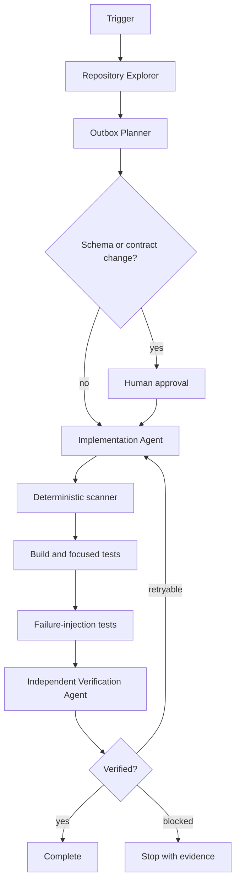

# Agent Transactional Outbox Delivery Gate

Reusable implementation kit for AI coding agents that need to add, repair, or verify a transactional outbox workflow without creating duplicate side effects, message loss, or unsafe database coupling.

## Problem

Applications often update business state and publish an event in separate operations. A crash between those operations can lose messages; retrying can create duplicates. This kit establishes a repeatable workflow for transactional outbox changes: discover the write boundary, prove transaction scope, enforce durable outbox persistence, verify safe claiming and retries, and validate consumer-facing idempotency assumptions.

## Trigger

Use when adding or changing event publication tied to a database write, diagnosing missing/duplicate events, introducing an outbox dispatcher, modifying retry/claim logic, or reviewing AI-generated outbox code.

Do not use for fire-and-forget telemetry, purely in-memory workflows, or systems where the database and broker are already atomically coordinated by another proven mechanism.

## Inputs

- Repository root.
- Task/incident description.
- Database technology and migration mechanism.
- Broker/transport abstraction.
- Existing transaction, retry, background-job, and consumer code.
- Optional runtime evidence: logs, dead-letter data, duplicate IDs, delivery timestamps.

## Core model

**Problem → Trigger → Inputs → Context → Plan → Execute → Verify → Recover/Approve → Outputs**



## Package tree

```text
agent-transactional-outbox-delivery-gate/
├── README.md
├── config/outbox-gate.json
├── examples/evidence.example.json
├── hooks/post-edit-verification.md
├── hooks/pre-task-validation.md
├── rules/outbox-safety.md
├── schemas/evidence.schema.json
├── scripts/run-gate.sh
├── scripts/scan-outbox.py
├── scripts/validate-config.py
├── scripts/verify-evidence.py
├── skills/outbox-investigation.md
├── skills/outbox-repair.md
├── skills/outbox-verification.md
├── subagents/implementation-agent.md
├── subagents/outbox-planner.md
├── subagents/repository-explorer.md
├── subagents/verification-agent.md
├── tests/test-scan-outbox.py
└── workflows/end-to-end.md
```

## Installation

Copy the full directory into a repository. Python 3.10+ is required; the scripts use only the standard library. `run-gate.sh` requires a POSIX shell.

Validate package configuration:

```bash
python3 scripts/validate-config.py --config config/outbox-gate.json
python3 -m unittest tests/test-scan-outbox.py
```

## Configuration

Edit `config/outbox-gate.json` to match repository roots and naming conventions. The scanner is heuristic: findings are investigation leads, not confirmed defects.

## Usage

```bash
./scripts/run-gate.sh --repo /path/to/repo --evidence /tmp/outbox-evidence.json
```

Or run the scanner directly:

```bash
python3 scripts/scan-outbox.py --repo /path/to/repo --config config/outbox-gate.json --output /tmp/outbox-scan.json
```

## Agent invocation

> Follow `workflows/end-to-end.md`. Map the business write, outbox insert, commit boundary, claim/lease behavior, publish result handling, retry state, and consumer duplicate behavior. Treat scanner output as hypotheses. Implement the smallest safe change, run focused and failure-injection tests, then hand off to the Verification Agent.

## Approval boundaries

Explicit human approval is required before database schema changes, destructive SQL, production deployment/configuration changes, breaking event contracts, deleting outbox records beyond an already-approved retention policy, infrastructure changes, secret changes, force pushes, or weakening delivery/idempotency safeguards.

## Failure handling

- Validation/config failure: stop immediately.
- Build/test failure: preserve output; at most two implementation retries.
- Transient tool failure: retry once.
- Permission failure: stop; never escalate privileges automatically.
- Missing failure-injection capability: verify with deterministic simulation or report verification blocked.
- Ambiguous transaction ownership: stop before broad refactoring.

## Verification

Execution is not verification. Verified status requires evidence that:

- business state and outbox insert share the intended transaction;
- the dispatcher uses bounded claiming/locking and does not create concurrent duplicate ownership silently;
- publish success is recorded only after broker success is known;
- failure leaves the record retryable rather than lost;
- retry state is bounded and observable;
- duplicate publication is treated as possible and downstream idempotency assumptions are explicit;
- build/tests pass;
- failure-injection tests cover commit/publish/retry boundaries;
- evidence JSON validates;
- an independent verifier records `verified`.

## Definition of Done

1. Relevant write path and dispatcher path are mapped.
2. Transaction boundaries are proven with code/tests, not assumed.
3. Required changes exist and are minimal.
4. Focused tests and failure-injection tests pass.
5. Scanner findings are resolved, explained, or marked non-applicable with evidence.
6. Required approvals are present.
7. Independent verification passes.
8. Remaining risks are documented and no blocking failure remains.

## Portability

The Markdown procedures are tool-neutral and can be used with Codex, Claude Code, Cursor, ChatGPT, GitHub Copilot, OpenCode, or other agents. Framework-specific details should be added in repository-local extensions rather than changing the core safety model.
