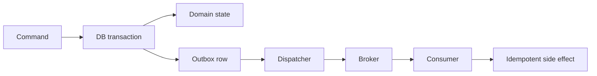

# Transactional Outbox Delivery Verification Gate

Reusable AI engineering kit for implementing and verifying reliable database-to-message delivery with the transactional outbox pattern.

## Problem

A service can commit domain state and fail before publishing the corresponding integration event, or publish an event and fail before committing state. Dual writes create inconsistency, duplicate delivery, and hard-to-reproduce production incidents.

This package gives an agent a bounded workflow to discover write paths, introduce or repair an outbox, validate dispatcher semantics, test idempotency, and independently verify delivery evidence.

## Trigger

Use when a feature or incident involves database state plus message/event publication, retrying publishers, background dispatchers, exactly-once claims, missing events, duplicate events, or migration from direct publish to outbox delivery.

Do not use when the operation has no durable state transition or no external message side effect.

## Inputs

- repository root;
- affected command/use case;
- data store and transaction boundary;
- message broker or publisher abstraction;
- existing retry/idempotency behavior;
- acceptance criteria;
- optional production incident evidence.

## Architecture



## Package tree

```text
agent-transactional-outbox-delivery-verification-gate/
├── README.md
├── config/outbox-gate.json
├── schemas/evidence.schema.json
├── examples/evidence.example.json
├── skills/outbox-investigation.md
├── skills/outbox-implementation.md
├── skills/outbox-verification.md
├── rules/safety-and-correctness.md
├── subagents/repository-explorer.md
├── subagents/implementation-agent.md
├── subagents/verification-agent.md
├── workflows/end-to-end.md
├── hooks/pre-task-validation.md
├── hooks/post-edit-verification.md
├── scripts/scan-outbox-risk.py
├── scripts/verify-evidence.py
├── scripts/run-gate.sh
└── tests/test-scan-outbox-risk.py
```

## Installation

Copy this directory into a repository. Python 3.10+ is required for the deterministic scripts. `run-gate.sh` requires a POSIX shell.

Validate the package:

```bash
python3 scripts/scan-outbox-risk.py --repo /path/to/repo --config config/outbox-gate.json --output /tmp/outbox-scan.json
python3 -m unittest tests/test-scan-outbox-risk.py
```

## Workflow

1. Map the domain write path and publish path.
2. Prove the current transaction boundary.
3. Identify failure windows and duplicate-delivery behavior.
4. Plan the smallest safe change.
5. Implement atomic state + outbox persistence.
6. Implement bounded dispatcher retry and claim/lease semantics where needed.
7. Verify consumer idempotency or equivalent duplicate tolerance.
8. Run build/tests plus deterministic scanning.
9. Produce evidence matching `schemas/evidence.schema.json`.
10. Require independent verification.

Maximum implementation retries: **2**. Tool retries are limited to one clearly transient retry.

## Approval boundaries

Explicit human approval is required before database schema changes, production migrations, destructive SQL, production deployment/configuration changes, broker infrastructure changes, breaking public/message contracts, data deletion, secret changes, force pushes, or weakening security controls.

The agent must stop before the approval-required action. It may prepare migration files or plans, but may not execute protected actions.

## Verification

A task is only `verified` when evidence proves all applicable points:

- business state and outbox record are written in one transaction;
- no direct publish remains inside the protected transaction path unless explicitly justified;
- dispatcher failures leave records retryable rather than silently lost;
- successful delivery produces a durable completion marker or safe deletion policy;
- duplicate dispatch is tolerated by broker/consumer semantics or explicit idempotency;
- tests exercise commit failure, publish failure, retry, and duplicate scenarios relevant to the implementation;
- build/static checks pass;
- evidence schema validates;
- independent verifier confirms the result;
- no approval-required action is pending.

## Definition of Done

- transaction boundary is documented with evidence;
- failure windows are enumerated;
- required repository changes exist;
- tests prove atomic persistence and retry behavior;
- duplicate-delivery behavior is verified;
- deterministic scanner has no unexplained blocking findings;
- independent verification status is `verified`;
- residual risks are explicit;
- no blocking failure remains.

## Usage

```bash
./scripts/run-gate.sh --repo /path/to/repository --evidence /tmp/outbox-evidence.json
```

Agent invocation:

> Follow `workflows/end-to-end.md` for the affected write-and-publish path. Separate facts, hypotheses, and decisions. Do not execute migrations or production changes. Implement the smallest safe transactional-outbox repair, test failure windows and duplicate delivery, then hand off to the Verification Agent.

## Customization

Edit `config/outbox-gate.json` to tune source roots, exclusions, transaction/publish patterns, outbox terminology, and blocking thresholds. The scanner is heuristic evidence for investigation; it does not itself prove correctness.
