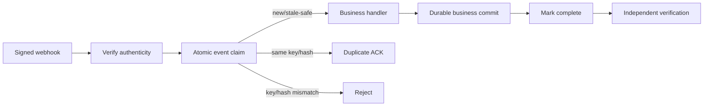

# Agent Webhook Replay Idempotency Gate

A reusable engineering kit for preventing webhook/provider retries, queue redelivery and operator replays from executing the same business side effect more than once.

## Problem and purpose
Webhook delivery is normally at-least-once. A timeout can occur after a handler commits a payment, notification, provisioning action or database update but before the provider receives the response. A naive retry can repeat the side effect. This kit gives coding agents an evidence-first workflow, enforceable safety rules, independent verification and a deterministic reference gate for atomic event claims.

Use it when adding/changing webhook handlers, diagnosing duplicate effects, introducing queues behind webhooks, or changing provider retry/replay behavior. Do not use it as a replacement for provider signature verification, business transaction design, or exactly-once claims across systems that cannot provide atomicity.

## Architecture


The Repository Explorer maps evidence and crash windows. The Implementation Agent makes the smallest safe change. The Verification Agent independently proves the gate behavior. `scripts/webhook_gate.py` is a dependency-free SQLite reference implementation demonstrating atomic claim, payload binding, duplicate acknowledgement, stale-processing recovery and completion. It is a reference/local gate, not a universal production persistence adapter.

## Package tree
```text
agent-webhook-replay-idempotency-gate/
├── README.md
├── config/policy.yaml
├── hooks/lifecycle.md
├── rules/safety.md
├── schemas/decision.schema.json
├── scripts/webhook_gate.py
├── scripts/verify_package.py
├── skills/investigate-webhook-path.md
├── skills/implement-idempotency.md
├── subagents/repository-explorer.md
├── subagents/implementation-agent.md
├── subagents/verification-agent.md
├── tests/test_webhook_gate.py
└── workflows/webhook-replay-gate.md
```

## Installation and dependencies
Copy this directory into the target repository. Core scripts require Python 3.9+ and SQLite from the Python standard library. Tests require `pytest`. No network service or secret is required for the reference gate.

## Configuration
Review `config/policy.yaml`. Adapt retention to the provider replay window, processing TTL to realistic handler duration, header candidates to the provider contract, and duplicate response status to provider requirements. Production storage should use the target datastore's atomic insert/conditional-write primitive. Never replace atomicity with application-only check-then-insert.

## Permissions
Exploration and verification should be read-only except for local test artifacts. Implementation needs repository edit and local test permissions. Production deployment, schema application, production configuration, destructive cleanup, secret changes, security weakening and irreversible migrations require explicit human approval.

## Usage
First follow `skills/investigate-webhook-path.md`, then execute `workflows/webhook-replay-gate.md` under `rules/safety.md`.

Reference gate example:
```bash
printf '{"event":"paid"}' > /tmp/event.json
python scripts/webhook_gate.py --db /tmp/gate.db --key evt_123 --payload /tmp/event.json
python scripts/webhook_gate.py --db /tmp/gate.db --key evt_123 --payload /tmp/event.json
python scripts/webhook_gate.py --db /tmp/gate.db --key evt_123 --payload /tmp/event.json --complete
```
The first claim exits 0; an identical active/completed duplicate exits 3; key reuse with different bytes exits 4; invalid input exits 2. Integrations should map these decisions to their provider-specific HTTP/queue semantics rather than blindly exposing process exit codes.

Run package checks:
```bash
python -m pytest tests/test_webhook_gate.py
python scripts/verify_package.py
```

## Workflow, recovery and verification
The workflow is Explore → Plan → Implement → Test → Independent Verify → Approval if required → Complete. Transient tool/environment failures retry at most twice. Verification can return to implementation for at most two total implementation/verification cycles. Deterministic assertion failures require changed evidence or code before rerun. Permission failures stop rather than escalating privileges.

A task is only `verified` when authenticity precedes the claim; event identity is documented; the claim is atomic and payload-bound; identical duplicates cannot repeat side effects; mismatched reuse is rejected; stale recovery/crash behavior is explicit; relevant build/tests pass; the diff contains no unintended changes; independent verification passes; and all approval-required actions have human approval.

## Approval boundaries
Agents must stop before applying production schema/configuration changes, destructive data cleanup, production deployment, secret changes, weakening signature/security controls, breaking contracts, force pushes, infrastructure changes or irreversible migrations.

## Customization
Keep the workflow, safety invariants and verification contract tool-neutral. Replace only the reference persistence implementation with the repository's transactional database, Redis conditional primitive, Cosmos conditional create, or equivalent atomic mechanism. Add provider-specific signature and response adapters outside the core gate, and extend focused tests with the real handler's observable side effects.

## Schema example

`examples/decision.example.json` is a synthetic instance of `schemas/decision.schema.json` for contract smoke tests. It contains no production data and demonstrates shape only; validate it with the package's documented checker or a Draft 2020-12 JSON Schema validator before adapting it.
