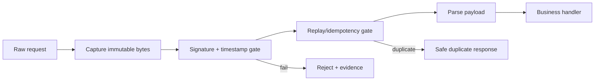

# Agent Webhook Replay & Signature Gate

A reusable implementation kit for AI-assisted webhook integrations. It prevents agents from shipping handlers that accept forged, stale, replayed, or ambiguously canonicalized webhook requests.

## Problem
Webhook handlers often validate business payloads but miss transport authenticity. Common failures include comparing signatures non-constantly, hashing a parsed body instead of raw bytes, ignoring timestamps, accepting duplicate event IDs, or disabling verification during debugging.

## Use when
Use before adding or modifying inbound webhooks, provider SDK adapters, retry handlers, event ingestion, or webhook secret rotation. Do not use this kit as a substitute for a provider's official verification algorithm; configure the provider-specific signing contract first.

## Architecture


The AI workflow separates repository discovery, implementation, adversarial testing, and independent verification. Deterministic scripts validate evidence and run portable HMAC fixtures.

## Package tree
```text
README.md
config/policy.example.json
schemas/evidence.schema.json
skills/discover-signing-boundary.md
skills/implement-verification.md
skills/verify-replay-resistance.md
rules/webhook-safety.md
subagents/repository-explorer.md
subagents/implementation-agent.md
subagents/verification-agent.md
workflows/webhook-security-gate.md
hooks/pre-implementation.md
hooks/final-verification.md
scripts/verify_fixture.py
scripts/validate_evidence.py
examples/evidence.example.json
```

## Installation
Copy this directory into the target repository. Python 3.10+ is required only for the deterministic scripts; runtime webhook verification may use the application's native language/framework. Copy `config/policy.example.json` to a project-owned policy file and adapt header names, timestamp tolerance, digest, replay key, and provider contract.

## Permissions
Repository read access is sufficient for discovery. Implementation needs write access only to the webhook module and tests. Production secrets, secret rotation, production deployment, infrastructure changes, disabling signature checks, or widening timestamp tolerance beyond policy require explicit human approval.

## Usage
1. Run the discovery skill and produce evidence conforming to `schemas/evidence.schema.json`.
2. Run `python scripts/validate_evidence.py evidence.json`.
3. Follow `workflows/webhook-security-gate.md`.
4. Implement against raw request bytes and the provider's documented signing contract.
5. Use `python scripts/verify_fixture.py --secret test-secret --body examples/body.json --timestamp 1700000000` for local HMAC fixture checks where the configured provider uses `HMAC-SHA256(timestamp + '.' + raw_body)`.
6. Execute repository tests plus adversarial cases.
7. Run independent verification and the final hook.

## Approval boundaries
Stop before changing production secrets, deploying, changing gateway/proxy body handling, weakening signature/timestamp/replay requirements, deleting replay records, or changing a public webhook response contract incompatibly.

## Failure and recovery
Transient test/tool failures may be retried twice while preserving logs. Validation failures are not retryable without correcting evidence. A provider-contract ambiguity, missing raw-body access, missing replay store, permission failure, or inability to test duplicate delivery blocks completion and is escalated with evidence.

## Verification
Success requires: provider signing contract identified; raw bytes verified before parsing; constant-time signature comparison; timestamp freshness enforced when supported; replay identity atomically claimed; malformed/missing/stale/forged requests rejected; duplicate delivery proven safe; repository build/tests pass; evidence schema validates; independent verifier signs off.

## Definition of Done
The gate is complete only when all required evidence fields are populated, implementation and adversarial tests pass, no approval boundary was crossed without approval, duplicate processing cannot produce a second protected side effect in the tested model, and the verification agent reports `verified`.

## Customization
For asymmetric providers, replace the HMAC fixture with provider-native verification while preserving the workflow. For providers without timestamps or event IDs, document that fact and use the strongest provider-supported replay strategy; never invent protocol fields.