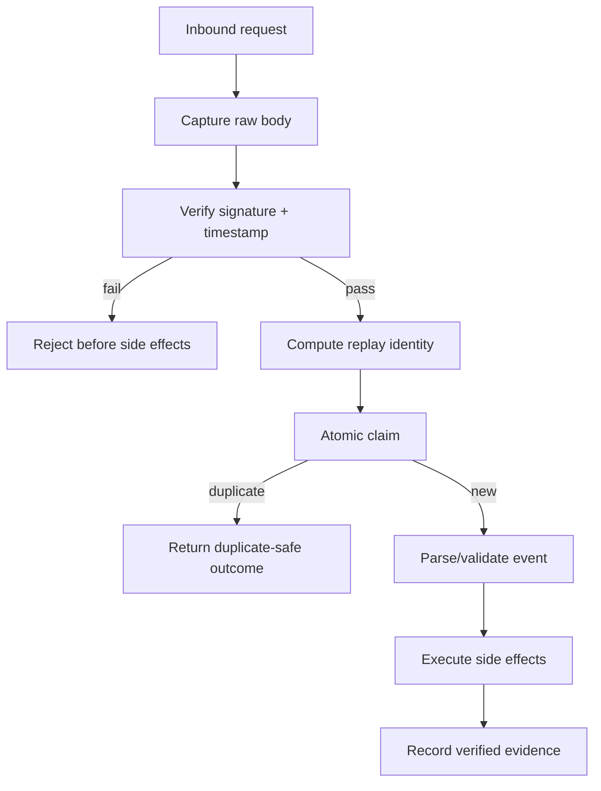

# Agent Webhook Signature Replay Gate

Reusable implementation kit for AI-assisted development of inbound webhook handlers that must verify authenticity, freshness, replay resistance, and safe duplicate behavior before side effects execute.

## Problem
Webhook endpoints often accept attacker-controlled HTTP requests. A handler may parse valid JSON and still be unsafe if it verifies the wrong bytes, accepts stale timestamps, ignores duplicate delivery identifiers, compares MACs non-constantly, performs side effects before verification, or treats retries as new business events.

## Trigger
Use when adding or changing webhook endpoints, provider adapters, signature verification, retry handling, event deduplication, or incident fixes involving duplicate/forged webhooks.

## Inputs
Provider signature specification, endpoint code, raw request bytes, relevant headers, shared-secret retrieval boundary, replay/dedup storage semantics, expected timestamp tolerance, and side-effect entry points.

## Architecture


## Package tree
```text
agent-webhook-signature-replay-gate/
├── README.md
├── config/webhook-policy.json
├── examples/request.json
├── hooks/final-verification.md
├── hooks/pre-task.md
├── rules/webhook-security-rules.md
├── schemas/evidence.schema.json
├── scripts/webhook_guard.py
├── skills/discover-webhook-boundary.md
├── skills/implement-verification.md
├── subagents/repository-explorer.md
├── subagents/implementation-agent.md
├── subagents/verification-agent.md
├── tests/test_webhook_guard.py
└── workflows/webhook-safety-workflow.md
```

## Installation
Copy this directory into a repository. Requires Python 3.9+ for deterministic checks. No third-party Python packages are required.

## Configuration
Edit `config/webhook-policy.json`: provider header names, maximum timestamp skew, accepted digest algorithm, replay-id header, and allowed endpoint source globs. Never place webhook secrets in the policy file.

## Usage
```bash
python scripts/webhook_guard.py verify-fixture --policy config/webhook-policy.json --fixture examples/request.json
python -m unittest tests/test_webhook_guard.py
```

The script verifies canonical fixture behavior and can be used by CI. Production framework integration remains repository-specific and is owned by the implementation workflow.

## Workflow
Follow `workflows/webhook-safety-workflow.md`: map the raw-body boundary, trace side effects, create an implementation plan, implement the smallest safe change, run deterministic verification, test negative cases, independently verify, and stop on unresolved security ambiguity.

## Approval boundaries
Human approval is required before weakening timestamp tolerance, disabling replay detection, changing secret storage/access, accepting unsigned events, changing production configuration, performing destructive data cleanup, or changing externally visible API contracts.

## Failure handling
Transient tool failures may be retried twice. Signature mismatches, replay-storage races, and failing negative tests are deterministic failures and must not be bypassed. Implementation/test-fix cycles are limited to three before escalation with evidence preserved.

## Verification
Success requires evidence that: raw bytes are verified before parsing-dependent mutation; timestamp freshness is enforced; MAC comparison is constant-time; replay identity is atomically claimed before side effects; duplicate delivery behavior is defined; negative tests reject invalid, stale, missing, and tampered requests; relevant repository tests pass; independent verification is complete.

## Definition of Done
- Request verification boundary and side effects are mapped.
- Signature input matches provider requirements exactly.
- Missing/invalid/stale signatures are rejected before side effects.
- Replay/duplicate handling is atomic and race-safe for the chosen store.
- No secret values appear in logs or evidence.
- Deterministic package tests pass.
- Relevant repository tests pass.
- Final verifier reports `verified` with no blocking findings.

## Portability
Core instructions are tool-neutral and can be used with Codex, Claude Code, Cursor, ChatGPT, GitHub Copilot, OpenCode, or other coding agents. Tool-specific framework adapters should stay in the consuming repository.