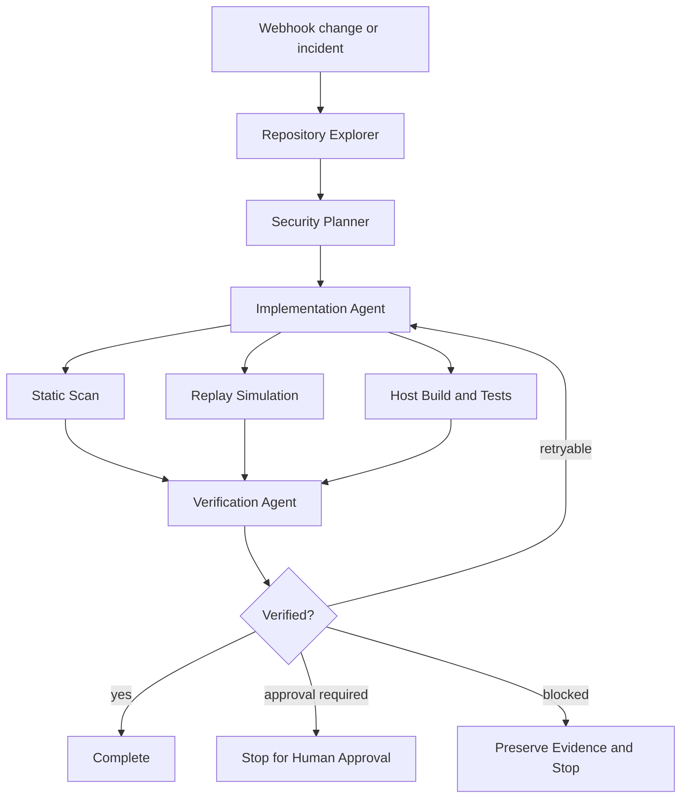

# Agent Webhook Signature Replay Protection Gate

Reusable implementation kit for AI-assisted webhook security work. It turns webhook verification into an evidence-based workflow with deterministic checks for raw-body signing, timestamp freshness, constant-time comparison, replay protection, secret hygiene, and independent verification.

## Problem

Webhook handlers often look correct while remaining exploitable or unreliable. Common defects include verifying a parsed/re-serialized body instead of the original bytes, accepting stale signed messages, comparing signatures with ordinary equality, omitting replay protection, using the wrong secret scope, logging credentials, or returning success before durable processing semantics are established.

AI coding agents can worsen this by copying provider snippets without checking the host framework's request-body behavior or by treating a successful signature test as proof of replay safety.

## Trigger

Use this kit when adding, changing, reviewing, or debugging an inbound webhook endpoint, signature middleware, replay cache, provider SDK integration, queue handoff, or incident involving duplicate or forged webhook delivery.

## Inputs

- Repository root.
- Webhook route or handler path.
- Provider signing contract: algorithm, signed payload format, header names, timestamp rules, and retry behavior.
- Host framework/runtime.
- Existing tests and request-body middleware.
- Optional incident evidence such as duplicate event IDs or signature failures.

## Outputs

- Boundary inventory and evidence report.
- Deterministic source scan output.
- Replay simulation results.
- Repository changes and tests when repair is required.
- Machine-checkable verification evidence matching `schemas/evidence.schema.json`.

## Architecture



## Package tree

```text
agent-webhook-signature-replay-protection-gate/
├── README.md
├── config/
│   └── gate.json
├── examples/
│   └── evidence.example.json
├── hooks/
│   ├── post-edit.md
│   └── pre-task.md
├── rules/
│   └── webhook-security.md
├── schemas/
│   └── evidence.schema.json
├── scripts/
│   ├── run-gate.sh
│   ├── scan-webhook-security.py
│   ├── simulate-replay-window.py
│   └── validate-evidence.py
├── skills/
│   ├── investigate-webhook-boundary.md
│   ├── repair-signature-replay.md
│   └── verify-webhook-security.md
├── subagents/
│   ├── implementation-agent.md
│   ├── repository-explorer.md
│   └── verification-agent.md
├── tests/
│   └── test-scripts.py
└── workflows/
    └── end-to-end.md
```

## Dependencies

Python 3.10+ is required for deterministic scripts. They use only the Python standard library. `run-gate.sh` requires a POSIX shell. Host build/test dependencies remain repository-specific.

## Installation

Copy this directory into the target repository without changing its internal layout. Then review `config/gate.json`.

```bash
python3 scripts/scan-webhook-security.py --repo /path/to/repo --config config/gate.json --output /tmp/webhook-scan.json
python3 scripts/simulate-replay-window.py --timestamp 1700000000 --now 1700000100 --window-seconds 300
python3 -m unittest tests/test-scripts.py
```

## Configuration

`config/gate.json` defines source roots, excludes, signature/timestamp/replay evidence patterns, and the maximum allowed count of unresolved high-confidence findings. Patterns are deliberately heuristic. A scanner hit is a lead, not a confirmed defect.

## Usage

Run the complete deterministic portion:

```bash
./scripts/run-gate.sh --repo /path/to/repo --output-dir /tmp/webhook-gate
```

The agent workflow then inspects the generated scan, runs repository-specific tests, and creates evidence JSON for independent verification.

## Core security contract

A verified handler must demonstrate all applicable properties:

1. Signature verification uses the exact provider-defined bytes and canonical signed components.
2. The signing secret is retrieved through approved configuration and is not logged.
3. Cryptographic comparison is constant-time or delegated to a provider SDK that guarantees equivalent behavior.
4. Timestamp or freshness validation is enforced when the provider protocol supports it.
5. Replay protection uses a stable provider event/message identifier or a cryptographic replay key with atomic first-use semantics.
6. Duplicate delivery is handled idempotently and distinguishable from malicious replay where the provider contract allows.
7. Verification happens before business side effects.
8. Failure responses do not disclose secrets or verification internals.
9. Tests prove valid, invalid, stale, duplicate, and malformed cases.

## Approval boundaries

Stop for explicit human approval before production deployment, secret rotation, production configuration changes, disabling signature/freshness checks, changing public webhook contracts, destructive data changes, infrastructure modifications, force push/history rewrite, or weakening any security control.

## Failure and recovery

- Configuration or schema validation failure: stop immediately.
- Static scan failure: preserve JSON and stop if the scanner itself errors.
- Host test/build failure: diagnose once, then allow at most two implementation retries.
- Transient tool failure: retry once.
- Permission failure: never increase privileges automatically.
- Missing provider contract: do not invent signing semantics; mark verification blocked.
- Replay store unavailable: do not silently fall back to no replay protection.

## Verification

`Task executed` means edits/scripts were run. `Task verified successfully` requires evidence from tests and code inspection plus independent verification.

The verifier must confirm the evidence schema, inspect affected boundaries, and ensure no unresolved high-risk finding remains. The implementation agent cannot self-approve.

## Definition of Done

- Affected webhook boundaries and signing inputs are mapped.
- Provider contract assumptions are explicit and evidenced.
- Raw-body behavior is proven.
- Signature, freshness, and replay behavior are tested.
- Replay state uses atomic first-use semantics or a documented equivalent.
- Static scan findings are resolved or explained.
- Host build/tests pass where applicable.
- Evidence JSON validates.
- Independent verifier records `verified`.
- No approval-required action is pending.
- Remaining risks are documented.
