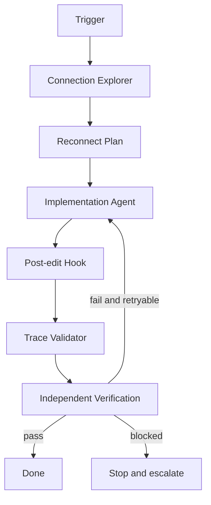

# Agent WebSocket Reconnect Session Consistency Gate

Reusable implementation kit for AI-assisted investigation and repair of WebSocket reconnect defects that cause duplicated subscriptions, lost messages, stale sessions, invalid replay windows, or inconsistent client/server state.

## Problem
A WebSocket client can reconnect successfully at the transport layer while application state is still wrong. Common failures include duplicate event handlers, replay gaps, stale session identifiers, subscriptions restored twice, sequence counters reset incorrectly, and unbounded reconnect storms.

## Purpose
Turn reconnect work into an evidence-based workflow with deterministic trace validation, bounded retries, explicit recovery rules, and independent verification.

## When to use
Use when changing WebSocket connection code, session recovery, subscription restoration, replay logic, heartbeat behavior, reconnect backoff, or when incidents show duplicate/lost events after disconnects.

## When not to use
Do not use as a generic load-testing framework, protocol fuzzer, production traffic replayer, or substitute for server-side delivery guarantees.

## Architecture


## Package tree
```text
agent-websocket-reconnect-session-consistency-gate/
├── README.md
├── config/reconnect-policy.json
├── examples/reconnect-trace.json
├── hooks/final-verification.md
├── hooks/post-edit.md
├── rules/reconnect-rules.md
├── schemas/reconnect-trace.schema.json
├── scripts/validate_reconnect_trace.py
├── skills/investigate-reconnect-path.md
├── skills/implement-safe-reconnect.md
├── subagents/connection-explorer.md
├── subagents/implementation-agent.md
├── subagents/verification-agent.md
├── tests/test_validate_reconnect_trace.py
└── workflows/reconnect-consistency-workflow.md
```

## Installation
Copy this directory into a repository. Python 3.9+ is required for the deterministic validator. No third-party Python packages are required.

## Configuration
Edit `config/reconnect-policy.json` to set maximum reconnect attempts, minimum/maximum backoff, sequence-gap policy, duplicate-subscription tolerance, and whether session identity must remain stable across reconnect.

## Permissions
Core workflow requires repository read/write access and test execution only. It does not require production credentials, infrastructure mutation, deployment permission, or secret rotation.

## Usage
Validate a captured or synthetic reconnect trace:
```bash
python scripts/validate_reconnect_trace.py \
  --trace examples/reconnect-trace.json \
  --policy config/reconnect-policy.json \
  --out .reconnect/verification.json
```

Run deterministic package tests:
```bash
python -m unittest tests/test_validate_reconnect_trace.py
```

## Workflow
Follow `workflows/reconnect-consistency-workflow.md`. The explorer maps connection/session/subscription state. The implementation agent makes the smallest evidenced change. The verification agent independently checks traces and repository tests.

## Approval boundaries
Explicit human approval is required before changing production configuration, weakening authentication or authorization, changing public protocol contracts, disabling replay safeguards, modifying infrastructure, rotating secrets, or deploying to production.

## Failure handling
Transient test/tool failures may be retried at most twice. Implementation/test-fix cycles are capped at three. Deterministic trace failures are not blindly retried; the failed invariant and evidence are preserved.

## Verification
`Task executed` means reconnect code changed or tests ran. `Task verified successfully` requires repository tests to pass and a trace satisfying all enabled policy invariants: bounded attempts/backoff, no forbidden duplicate subscriptions, acceptable sequence continuity, correct session behavior, and no invalid state transition.

## Definition of Done
- Connection, session, subscription, replay, and sequence ownership are mapped.
- Required change is minimal and evidence-linked.
- Relevant tests pass.
- Validator exits 0 with status `verified`.
- Retry limits are finite.
- Required approvals exist.
- No unrelated changes remain.
- Remaining risks are documented and non-blocking.

## Customization
Extend the trace schema and validator with application-specific event types or delivery guarantees. Keep deterministic invariants in scripts and contextual reasoning in Skills/Subagents.