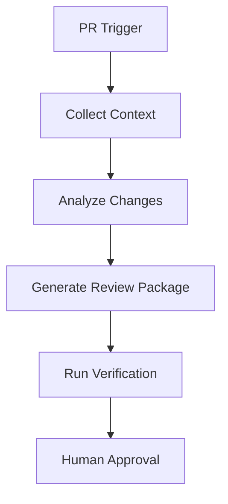

# AI Assisted PR Preparation Agent

Reusable AI engineering kit for preparing pull requests with structured evidence, review readiness, and bounded agent workflows.

## Problem
Developers often create PRs with missing context, incomplete tests, unclear risk, or inconsistent descriptions.

## Purpose
Automate preparation work before human review while keeping final approval with developers.

## Workflow


## Structure
- skills: reusable PR preparation procedures
- rules: safety constraints
- subagents: specialized analysis roles
- workflows: bounded execution lifecycle
- hooks: deterministic checks
- scripts: validation helpers

## Safety
No automatic merge, deployment, secret modification, or destructive action is allowed.

## Run

Requires Python 3.10+ and Git. From the target repository root, run:

```bash
python path/to/ai-assisted-pr-preparation-agent/scripts/check-pr-files.py
```

The preflight checks that the current directory is a Git working tree and contains `README.md`. Exit `0` means those minimum inputs exist; exit `1` lists missing inputs. It does not inspect a PR, run tests, or prove review readiness.

Then follow `workflows/pr-preparation-flow.md`, apply `rules/pr-safety-rules.md`, and run the target repository's build, test, lint, and diff checks. Completion requires an immutable base/head pair, a scoped change summary, recorded check results, residual risks, and human review.

## Verification

Replay the preparation flow on a synthetic or closed change. Confirm that missing context/checks remain explicit, the report is bound to the intended base/head revisions, no merge or remote mutation occurs, and a human can reproduce each reported command/result.
