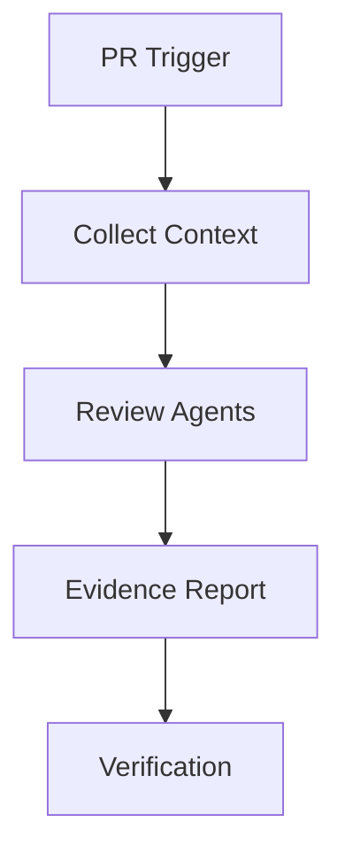

# AI Code Review Agent Kit

Reusable workflow for AI-assisted pull request review with evidence-based findings.

## Purpose
Reduce missed defects by combining repository context, deterministic checks, and specialized review agents.

## Workflow


Components:
- skills: review procedures
- rules: safety boundaries
- subagents: specialized reviewers
- workflows: execution lifecycle
- scripts: deterministic validation

Approval is required for any automatic code modification or merge decision.

## Run and input validation

Requires Python 3.10+. Send one JSON object on standard input:

```bash
printf '%s' '{"repository":"acme/service","pull_request":"42","files":["src/App.cs"]}' \
  | python scripts/validate-review-inputs.py
```

Required top-level keys are `repository`, `pull_request`, and `files`. Exit `0` emits `{"valid": true}`; exit `1` reports missing keys. Run from this package directory, or use an absolute script path. The validator checks presence only; it does not fetch the PR or verify that the paths/revisions are current.

## Verification

Follow the package workflow and run repository-native checks against the exact reviewed head revision. A completed review identifies evidence locations, distinguishes not-run checks from passes, and leaves merge/approval to an authorized human.
