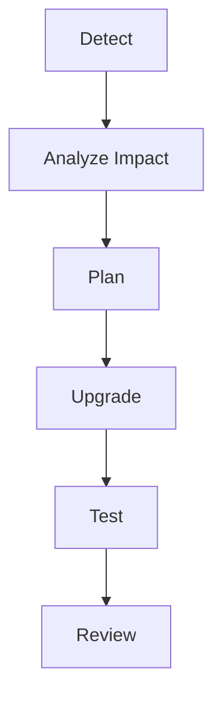

# AI Dependency Upgrade Agent

Reusable AI engineering kit for safe dependency upgrade workflows.

## Problem
Dependency upgrades often create hidden breaking changes, security regressions, and unnecessary code churn.

## Use when
- A package has a new major/minor release
- Security advisories require upgrades
- Framework upgrades are planned

## Workflow


The agent separates research, implementation, and verification.

## Safety
Human approval is required for major upgrades, breaking API changes, and production releases.

## Run

Requires Python 3.10+ and Git. Run from the target repository root before changing a dependency:

```bash
python path/to/ai-dependency-upgrade-agent/scripts/check-repository.py
```

Exit `0` means Git successfully reported a clean working tree. Exit `1` means Git failed or tracked/untracked changes are present. The check neither installs dependencies nor performs an upgrade.

## Verification

Follow `workflows/upgrade-workflow.md`, review `config/policy.json`, and run ecosystem-native restore/install, build, test, advisory, and lockfile-diff checks for the exact candidate. Record the old/new versions, compatibility source, changed transitive dependencies, migrations, rollback, and any approval. A clean preflight alone is not success.
