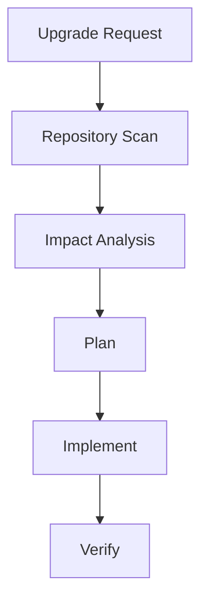

# AI Dependency Upgrade Review Agent

Reusable agent package for safely investigating and planning dependency upgrades.

## Problem
Dependency upgrades often fail because agents change versions without understanding compatibility, security impact, runtime behavior, or migration requirements.

## Workflow

## Runtime status and components

This is a **reference-only workflow package**. It has no executable script and requires no installation. The host repository supplies its package-manager commands, builds, tests, advisory lookup, and approval mechanism.

- `skills/dependency-impact-analysis.md`: repeatable analysis procedure.
- `rules/safety-rules.md`: safety and approval boundaries.
- `subagents/research-agent.md`: bounded research role.
- `workflows/upgrade-flow.md`: execution lifecycle.
- `hooks/pre-upgrade-validation.md`: host hook contract; this Markdown file is not an installed hook.

## Adoption and verification

Read the rule and workflow, map every command to the target repository, then rehearse against a disposable branch. Verification is manual: confirm the requested/current versions, compatibility evidence, diff and lockfile scope, repository-native build/tests, and human approval for breaking or production-impacting changes. Merely completing research is not proof that an upgrade is safe.

## Safety
Production changes, lockfile changes with major impact, breaking API migrations, and deployment actions require human approval.

## Definition of Done
- Upgrade reason documented
- Compatibility risks identified
- Tests/build verification completed
- Remaining risks recorded
