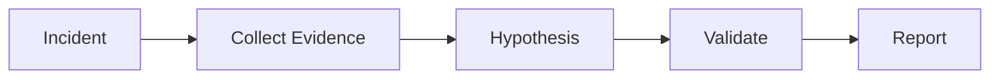

# AI Incident Root Cause Agent Kit

Reusable agent workflow for production incident investigation.

## Problem
Reduce slow, inconsistent debugging by forcing evidence-driven investigation.

## Usage
Trigger when production errors, alerts, or abnormal metrics require investigation.

Workflow:

## Runtime status and components

This is a **reference-only investigation procedure**. It has no collector, runtime adapter, or automated verifier and requires no installation.

- `skills/investigate-incident.md`: evidence-first investigation procedure.
- `rules/safety-rules.md`: production safety and approval boundaries.

Use it by providing an incident window, affected service, sanitized telemetry locations, and an evidence owner to the skill. The host must supply read-only log/metric/trace access and its own redaction controls.

## Verification
Success requires collected evidence, validated root cause, reproducible findings, and documented risks.

Before closing the investigation, independently confirm that each root-cause claim cites observable evidence, competing hypotheses were falsified where practical, no production mutation occurred, and the proposed verification can be reproduced. This package alone does not collect or validate evidence.
