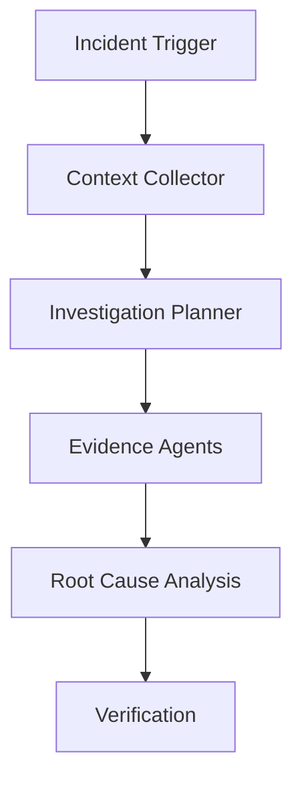

# AI Production Incident Investigator Agent

Reusable agent package for investigating production incidents with evidence-first workflows.

## Problem
Reduce unreliable AI debugging by forcing collection of logs, metrics, traces, code evidence, hypotheses, and verification steps.

## Use when
- Production errors occur
- Root cause is unclear
- Multiple services are involved
- Logs and telemetry need correlation

## Architecture

## Copy and install

Copy the complete package into a trusted incident workspace. It requires Python 3.10+ and only the standard library. The host must separately provide approved read-only access to sanitized logs, metrics, and traces; this package contains no production connector.

## Package
- skills/incident-investigation.md
- rules/incident-safety.md
- subagents/root-cause-analyst.md
- workflows/incident-response.md
- hooks/pre-investigation.md
- scripts/collect-context.py
- schemas/investigation-result.json

## Safety
Agents must not change production data, deploy fixes, or modify infrastructure without approval.

## Definition of Done
- Evidence collected
- Hypotheses validated
- Root cause separated from symptoms
- Verification completed
- Risks documented

## Run and verification

Requires Python 3.10+ and uses only the standard library. From the package directory, run `python scripts/collect-context.py` and capture its sanitized JSON output as described by the workflow. The collector is a local context scaffold, not a telemetry connector. Validate the completed handoff against `schemas/investigation-result.json`, reproduce the supported hypothesis independently, and record unavailable evidence as a limitation rather than a pass.
