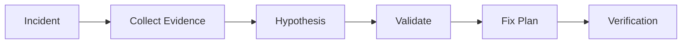

# AI Production Incident Investigator

Reusable AI agent package for investigating production incidents with evidence-first workflows.

## Problem
Reduce unreliable AI debugging by forcing agents to collect evidence, form hypotheses, validate changes, and stop before dangerous actions.

## Use when
- Production errors appear
- Logs, traces, metrics, and code need correlation
- Root cause is unknown

## Workflow


## Package
- skills: investigation procedures
- rules: safety boundaries
- subagents: separated responsibilities
- workflows: bounded execution
- hooks: deterministic checks
- scripts: evidence collection

## Safety
No production changes, database mutations, deployments, or configuration changes without approval.

## Definition of Done
- Evidence collected
- Root cause supported by facts
- Verification completed
- Risks documented

## Run

Requires Bash; Git is optional. Run only in an approved local workspace and choose an ignored output path:

```bash
bash scripts/collect-environment.sh artifacts/incident-context.txt
```

`scripts/collect-environment.sh` creates or replaces the named file with UTC time, host/user identifiers, and the current Git revision when available. Exit `0` means capture completed. Review and redact the file before sharing; host and user names can be sensitive, and the script does not collect application logs, metrics, traces, or production data.

## Verification

Verification requires independent correlation of sanitized evidence and reproduction/falsification of the supported hypothesis. Context capture is not root-cause proof and authorizes no remediation.
