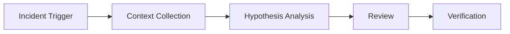

# AI Production Incident Triage Agent Kit

## Problem
Production incidents require fast diagnosis but agents can produce unsafe guesses without evidence discipline.

## Purpose
A reusable AI engineering package for incident investigation using context collection, bounded reasoning, specialist review, and verification.

## Workflow


## Usage
Use for API failures, background jobs, database issues, performance regressions, and service outages.

## Safety
Agents must not deploy, delete data, change production configuration, or execute destructive operations without approval.

## Done Criteria
- Evidence collected
- Findings separated from assumptions
- Root cause validated
- Verification evidence recorded

## Prerequisites and local utilities

Requires Python 3.10+; both utilities use only the standard library. Use synthetic or already-sanitized evidence:

```bash
SERVICE=checkout INCIDENT_ID=INC-0001 python scripts/collect-context.py artifacts/incident-context.json
python scripts/validate-incident-input.py path/to/incident-input.json
```

`collect-context.py` creates or replaces the requested JSON file and records only timestamp plus the two environment labels; its default output is `incident-context.json`. `validate-incident-input.py` requires a JSON object containing `summary` and `timestamp`: exit `0` is valid, exit `1` reports missing fields, and exit `2` is invocation/input failure. Neither script connects to production or validates a root cause.

## Verification

Run both utilities with synthetic valid, missing-field, and malformed inputs. Then independently reproduce any incident conclusion from sanitized source evidence; a valid input document is not a verified root cause.
