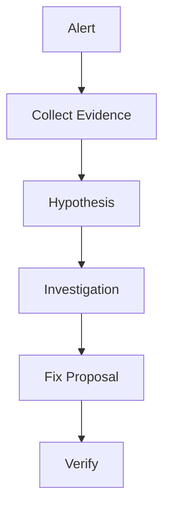

# AI Production Incident Triage Loop

Reusable agent kit for investigating production incidents with evidence, bounded recovery, and human approval.

## Purpose

Bound incident triage into evidence collection, hypothesis testing, approval, and verification stages without authorizing production changes.

## Use when
- Production alert fires
- Error rate increases
- Latency/regression appears

## Flow


Components:
- skills: repeatable investigation procedures
- rules: safety boundaries
- subagents: separated responsibilities
- workflow: bounded execution
- scripts: deterministic collection

Done means evidence collected, risk assessed, verification completed, and approvals obtained.

## Prerequisites, run, and verification

Requires Python 3.10+ and Git. From the target repository root:

```bash
python path/to/ai-production-incident-triage-loop/scripts/collect-context.py > artifacts/repository-context.json
python -m unittest discover -s path/to/ai-production-incident-triage-loop/tests -p "test*.py"
```

The collector prints the current Git revision and working-tree status as JSON. Exit `1` with an `error` object means collection failed. It gathers no service telemetry and must not be presented as incident evidence by itself. Use the package examples/configuration with sanitized inputs, follow the bounded workflow, and require approval before any production effect.
