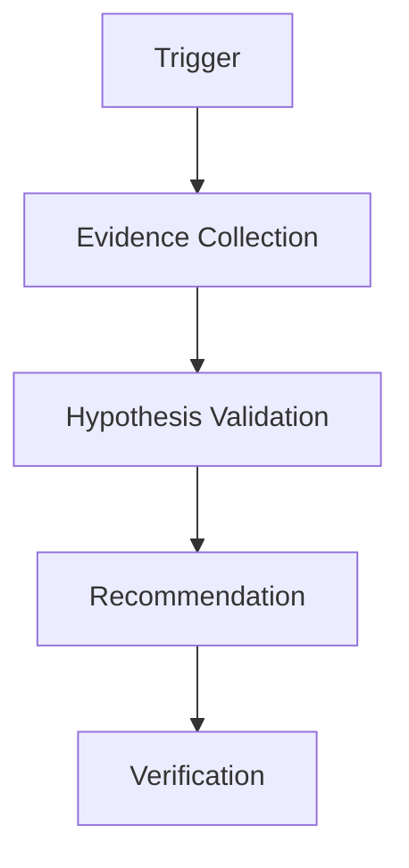

# Production Incident Root Cause Agent Kit

## Problem
Standardize AI-assisted production incident investigation using evidence, bounded hypotheses, and verification.

## Use when
- Production alerts occur
- Error rates increase
- Performance regressions appear
- Logs need correlation

## Workflow


## Components
- skills/evidence-collection.md
- skills/incident-investigation.md
- skills/hypothesis-validation.md
- rules/incident-safety.md
- subagents/evidence-reviewer.md
- subagents/root-cause-investigator.md
- workflows/incident-investigation.md
- workflows/root-cause-analysis.md
- hooks/pre-investigation.md
- scripts/collect-context.py
- scripts/validate-evidence.py

## Safety
Production changes, destructive operations, deployments, and data modifications require explicit approval.

## Prerequisites, run, and verification

Requires Python 3.10+. Initialize a local, ignored handoff file, then validate the externally supplied evidence location:

```bash
python scripts/collect-context.py artifacts/incident-context.json
INCIDENT_ID=INC-0001 EVIDENCE_PATH=artifacts/evidence python scripts/validate-evidence.py
```

`collect-context.py` creates or replaces the named JSON scaffold and exits `2` if the path argument is omitted. `validate-evidence.py` exits `0` when both environment variables are present and `1` when either is missing; it does not currently inspect the evidence path contents. Treat both as initialization/preflight only. Root cause requires sanitized evidence, falsification of alternatives, independent review, and reproducible verification.
