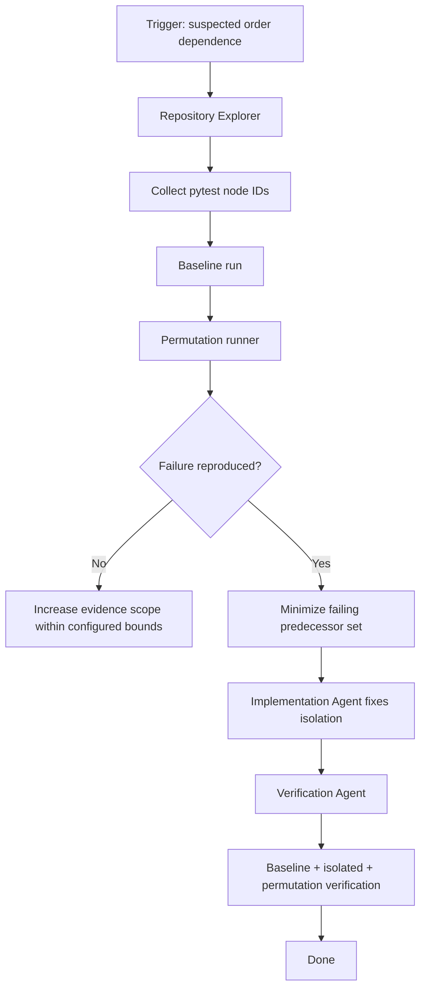

# Pytest Test Order Dependence Gate

A reusable AI-engineering kit for detecting test suites that pass in isolation but fail when test execution order changes because of leaked global state, environment mutation, filesystem residue, monkeypatch leakage, caches, singleton state, database residue, or fixture cleanup defects.

## Problem

Order-dependent tests create false confidence: the suite may pass locally or on one CI worker and fail under another ordering, shard, retry, or selective test run. AI coding agents are especially likely to misdiagnose these failures as random flakes unless execution order is made explicit and evidence is preserved.

This kit provides a deterministic investigation and verification workflow built around `pytest`.

## When to use

Use when:

- a test fails only in the full suite;
- CI failures are inconsistent across shards or reruns;
- a newly added test appears to break unrelated tests;
- fixture/global-state cleanup is suspect;
- a refactor changes test collection or execution order;
- you want a pre-merge guard against hidden test coupling.

Do not use for browser E2E suites that are not driven by pytest, or for failures already proven to be external-service instability.

## Architecture



## Package tree

```text
pytest-test-order-dependence-gate/
├── README.md
├── config/
│   └── gate-config.json
├── examples/
│   └── investigation-request.json
├── hooks/
│   ├── post-edit.md
│   └── pre-investigation.md
├── rules/
│   └── test-isolation-rules.md
├── schemas/
│   ├── investigation-request.schema.json
│   └── report.schema.json
├── scripts/
│   ├── order_gate.py
│   └── verify_package.py
├── skills/
│   ├── investigate-order-dependence.md
│   └── repair-test-isolation.md
├── subagents/
│   ├── repository-explorer.md
│   ├── implementation-agent.md
│   └── verification-agent.md
├── tests/
│   └── test_order_gate.py
└── workflows/
    └── order-dependence-workflow.md
```

## Requirements

- Python 3.10+
- `pytest` available in the target repository environment
- Git recommended for change inspection
- No third-party dependency is required by the gate itself

## Configuration

Edit `config/gate-config.json` only where needed. Defaults:

- 8 deterministic permutations
- seed `20260902`
- timeout 900 seconds per pytest invocation
- stop after the first 3 reproduced failures
- fail closed on collection or runner errors

The gate never edits tests and never deletes artifacts.

## Usage

Run against the current repository:

```bash
python scripts/order_gate.py --config config/gate-config.json --output .ai-evidence/order-report.json
```

Limit scope to a path or marker expression:

```bash
python scripts/order_gate.py \
  --config config/gate-config.json \
  --pytest-arg tests/unit \
  --pytest-arg=-m \
  --pytest-arg=not_slow \
  --output .ai-evidence/order-report.json
```

Investigate a known victim test and likely predecessors:

```bash
python scripts/order_gate.py \
  --config config/gate-config.json \
  --victim 'tests/test_cache.py::test_cache_is_empty' \
  --candidate 'tests/test_auth.py::test_login' \
  --candidate 'tests/test_settings.py::test_override' \
  --output .ai-evidence/order-report.json
```

## What the runner proves

The script distinguishes:

- `baseline_pass`: normal collected order passed;
- `baseline_fail`: suite already fails without reordering;
- `order_dependent_failure`: at least one deterministic permutation fails while baseline passes;
- `victim_reproduced`: the victim fails after at least one candidate predecessor sequence;
- `not_reproduced`: configured bounded search found no order-dependent failure;
- `runner_error`: collection or subprocess execution could not be trusted.

`not_reproduced` is not proof that no hidden coupling exists; it means the configured evidence search did not reproduce it.

## Workflow

1. Validate repository and pytest availability.
2. Collect exact node IDs.
3. Run baseline once.
4. Run bounded deterministic permutations.
5. Preserve failing order, stdout, stderr, return code, and duration.
6. If a victim is supplied, test candidate predecessors before the victim.
7. Minimize the smallest evidence-producing predecessor sequence manually or by narrowed reruns.
8. Fix the leaked state at its owner; do not merely force test ordering.
9. Verify the victim alone, predecessor+victim, baseline suite, and permutations.
10. Inspect the diff and record residual risks.

## Approval boundaries

This package performs read-only test execution. Human approval is required before any repair that includes destructive database cleanup, production resource access, schema changes, deletion outside disposable test directories, dependency upgrades, weakened security controls, force push, or CI infrastructure changes.

## Failure and recovery

- **Collection failure:** stop; preserve collection output. Maximum one retry after fixing deterministic environment/configuration issues.
- **Pytest timeout:** retry once only after confirming the test process was terminated and no external side effect remains ambiguous.
- **Baseline failure:** do not classify as order dependence until the baseline defect is understood or isolated.
- **Permutation failure:** preserve the exact order and seed; do not rerun without keeping the evidence-producing sequence.
- **No reproduction:** optionally increase permutations up to the configured project ceiling, then stop and report uncertainty.
- **Repair verification failure:** maximum two fix-and-retest cycles before escalation with evidence.

## Verification

Run the package self-check:

```bash
python scripts/verify_package.py
```

For a repaired target repository, verification requires:

1. known victim passes alone;
2. previously failing predecessor+victim sequence passes;
3. normal baseline passes;
4. configured deterministic permutations pass;
5. no production-only cleanup or order-forcing workaround was introduced;
6. changed fixtures/tests clean up all state they create;
7. diff contains only intended files.

## Definition of Done

The investigation is complete only when the failure is either reproduced with an exact order or explicitly reported as not reproduced within bounded search. A repair is complete only when the original evidence-producing sequence and all required verification checks pass. `Task executed` is not the same as `task verified successfully`.

## Customization

Use higher permutation counts only in CI/nightly contexts. Prefer focused test scopes for pull requests. If the repository uses `pytest-xdist`, first reproduce without parallelism; parallel scheduling introduces a different class of isolation defect that should be investigated separately.